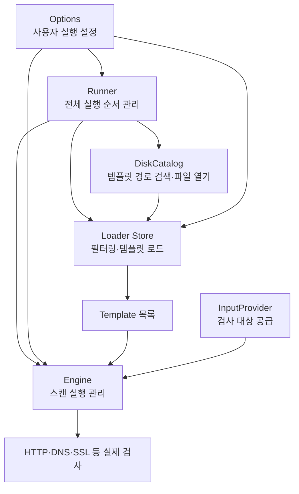

# Nuclei 실행 구성요소 관계
#architecture #전지성

> 클래스 다이어그램에서 인터페이스 부분을 제외하고 실제 Nuclei 소스에 맞게 수정한 전체 구조

## 사진에서 수정해야 하는 표현

| 사진의 표현 | 실제 코드 |
|---|---|
| `Runner.Run()` | `Runner.RunEnumeration()` |
| Runner의 `Engine engine` 필드 | Engine은 실행 도중 지역변수로 생성 |
| `Options.Tags []string` | `Tags goflags.StringSlice` |
| `Options.Severity []string` | `Severities severity.Severities` |
| `Options.OutputFile string` | `Output string` |
| Catalog 안의 Loader | Catalog와 Loader는 별도 구성요소 |
| `Catalog.GetTemplates()` | Loader의 `Load()`, `Templates()`에 가까움 |
| Engine의 `ProtocolExecutor executor` | 실제 필드는 `executerOpts *protocols.ExecutorOptions` |
| `Engine.Execute(template)` | 템플릿 목록과 대상 공급자를 받는 실행 함수 사용 |

## 수정한 관계도



## 전체 실행 순서

```text
main()
    ↓
runner.New(options)
    ↓
Runner 생성
    ├─ Options 연결
    ├─ DiskCatalog 생성
    └─ 입력·출력·속도 제한 등 준비
    ↓
RunEnumeration()
    ↓
ExecutorOptions 생성
    ↓
Engine 생성
    ↓
Loader Config와 Store 생성
    ↓
store.Load()
    ↓
선택된 Template 목록 생성
    ↓
engine.ExecuteScanWithOpts()
    ↓
실제 스캔 실행
```

## 각 구성요소 한 줄 정리

```text
Options
└─ 사용자가 어떤 방식으로 실행할지 저장

Runner
└─ 구성요소를 준비하고 전체 실행 순서를 관리

DiskCatalog
└─ 템플릿 파일의 위치를 찾고 파일을 엶

Loader Store
└─ Options 조건에 맞는 템플릿을 불러옴

Engine
└─ 템플릿과 검사 대상을 받아 실제 스캔을 실행
```

사진의 화살표는 상속 관계가 아니라 Runner가 각 구성요소를 생성하거나 사용한다는 관계로 이해하는 것이 적절하다.

**참조 :** [main](../01_Main_Flow/main.md), [pkg_types](pkg_types.md), [runner_runner](runner_runner.md), [catalog_disk](catalog_disk.md), [catalog_loader](catalog_loader.md), [core_engine](core_engine.md)
