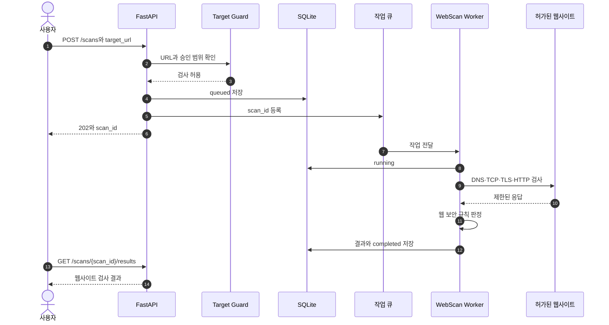
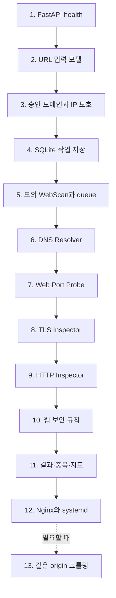

# 웹사이트 네트워크 스캐너 최종 가이드

> 문서 지도: [[README]] · 다음 문서: [[01 웹사이트 검사 Python 구현 설계]]


```text
입력: https://example.com

검사:
도메인과 URL 확인
  -> DNS와 실제 IP 확인
  -> 웹 포트 연결 확인
  -> TLS 인증서 확인
  -> HTTP/HTTPS 응답 확인
  -> 웹 보안 설정 규칙 확인

출력:
검사 상태 + 웹사이트 정보 + 발견 결과
```

Nuclei는 기존 스캐너 구조를 공부하기 위한 참고 자료일 뿐이다. Nuclei 코드, CLI, API, DAST 서버나 템플릿을 실행하거나 호환하지 않는다.

## 여기서 네트워크 검사의 뜻

이 문서의 “웹사이트 네트워크 검사”는 다음 범위를 뜻한다.

| 계층 | 확인할 내용 | 첫 버전 |
|---|---|---|
| URL | scheme, hostname, port, path | 포함 |
| DNS | A/AAAA 주소와 해석 성공 여부 | 포함 |
| TCP | URL이 사용하는 웹 포트 연결 여부 | 포함 |
| TLS | 인증서 이름, 발급자, 유효기간 | HTTPS일 때 포함 |
| HTTP | 상태 코드, redirect, 응답 시간, 제한된 헤더 | 포함 |
| 웹 보안 규칙 | 보안 헤더, Cookie 속성 등 수동적 검사 | 포함 |
| 웹 크롤링 | 같은 사이트의 여러 경로 발견 | 이후 |
| 로그인 검사 | 세션과 인증 흐름 | 이후 |
| 공격형 DAST | payload를 보내 동작을 바꾸는 능동 검사 | 이후 별도 검토 |
| LAN 장비 발견 | 같은 네트워크의 컴퓨터 검색 | 제외 |
| 임의 포트 스캔 | 전체 포트 검색 | 제외 |

첫 버전은 대상의 상태를 바꾸지 않는 **수동적·저위험 검사**부터 구현한다.

## 전체 구조

```mermaid
flowchart LR
    U[사용자] -->|URL과 검사 요청| N[Nginx]
    N --> V[Uvicorn]
    V --> F[FastAPI]
    F --> M[ScanManager]
    M --> Q[(작업 큐)]
    Q --> W[WebScan Worker]
    W --> G[Target Guard]
    G --> D[DNS Resolver]
    D --> P[Web Port Probe]
    P --> T[TLS Inspector]
    T --> H[HTTP Inspector]
    H --> R[Security Rules]
    R --> O[Finding과 Scan Result]
    O --> DB[(SQLite)]
    F --> DB
```



### 각 구성요소의 역할

| 구성요소 | 뜻 | 프로그램에서 하는 일 |
|---|---|---|
| Nginx | 앞단 웹서버 | 사용자가 스캐너 API에 접속하는 입구 |
| Uvicorn | ASGI 서버 | FastAPI 코드를 실제 HTTP 서버로 실행 |
| FastAPI | API 프레임워크 | 스캔 생성, 상태, 결과, 취소 API 제공 |
| ScanManager | 작업 관리자 | 작업 상태, queue, 취소와 worker 관리 |
| Target Guard | 대상 안전 검사 | URL, 승인 도메인, 실제 IP와 redirect 검사 |
| DNS Resolver | 도메인 해석기 | 도메인을 IPv4/IPv6 주소로 변환 |
| Web Port Probe | 웹 포트 연결 검사 | URL의 실제 포트에 TCP 연결 가능한지 확인 |
| TLS Inspector | HTTPS 인증서 검사 | 인증서 이름과 유효기간 확인 |
| HTTP Inspector | 웹 요청 실행기 | 제한된 GET 요청과 응답 정보 수집 |
| Security Rules | 판정 규칙 | 수집된 정보에서 보안 설정 누락 확인 |
| SQLite | 로컬 DB | 작업 상태와 제한된 결과 저장 |

Nginx는 검사 대상 웹사이트에 요청을 보내는 구성요소가 아니다. 사용자가 라즈베리파이의 FastAPI에 접속할 때 앞에서 요청을 전달하는 역할이다.

## 웹사이트 한 개가 검사되는 순서



## 많은 선택지 중 이 구성을 쓰는 이유

### FastAPI

비동기 API, Pydantic 입력 검증과 자동 API 문서를 함께 제공한다. Flask보다 현재 비동기 구조에 자연스럽고, Django보다 작은 API 제품을 시작하기 가볍다.

FastAPI는 웹사이트를 검사하지 않는다. 사용자의 요청과 결과 조회를 담당한다.

### Uvicorn

FastAPI는 ASGI 애플리케이션이므로 실제 네트워크 포트를 열어 실행할 ASGI 서버가 필요하다. 첫 버전에는 프로세스 하나만 사용해 메모리 queue가 여러 프로세스로 갈라지지 않게 한다.

### Nginx

외부 사용자가 스캐너 API에 접속하는 입구다. Uvicorn은 `127.0.0.1`에 숨기고 Nginx가 요청 크기와 HTTPS 같은 경계를 맡는다. 개발 초기에는 Uvicorn 직접 호출부터 확인한다.

### HTTPX

웹사이트에 비동기 HTTP/HTTPS 요청을 보내는 클라이언트다. timeout, connection pool과 streaming을 사용할 수 있어 응답 대기가 많은 웹 검사에 적합하다.

### asyncio

DNS, TCP, TLS와 HTTP 응답을 기다리는 동안 다른 작업을 진행하게 한다. 비동기는 무제한 실행이라는 뜻이 아니므로 semaphore, rate limit과 총 요청 예산을 함께 둔다.

### SQLite와 aiosqlite

라즈베리파이에 별도 DB 서버를 설치하지 않고 작업 상태와 결과를 파일 하나에 저장할 수 있다. JSON 파일보다 조회, 중복 처리와 상태 변경이 쉽다.

### Pydantic과 pydantic-settings

Pydantic은 URL과 API 입력 구조를 검증하고, pydantic-settings는 DB 위치, API 키, timeout, 허용 도메인 같은 설정을 환경변수로 관리한다.

### dnspython 사용 시점

첫 실험에서는 Python의 `asyncio.getaddrinfo()`로 충분하다. A, AAAA, CNAME, MX 등 DNS 세부 결과와 timeout 제어가 필요해질 때 `dnspython`을 추가한다. 처음부터 의존성을 늘리지 않는다.

## 첫 번째 버전에서 검사할 항목

### DNS

- 도메인 해석 성공 여부
- IPv4 A 주소
- IPv6 AAAA 주소
- 확인된 IP의 허용 정책

### TCP

- URL scheme에 따른 실제 포트만 확인
- `http` 기본값 80
- `https` 기본값 443
- URL에 명시된 포트가 있다면 해당 포트

임의의 전체 포트 스캔은 하지 않는다.

### TLS

- 인증서가 대상 hostname과 일치하는지
- 인증서 발급자
- 유효 시작일과 만료일
- 검증 오류

### HTTP/HTTPS

- 상태 코드
- 최종 응답 시간
- Content-Type
- 제한된 Server 정보
- redirect 위치
- 응답 크기

### 첫 웹 보안 규칙

- HTTPS 사이트의 HSTS 여부
- Content-Security-Policy 여부
- X-Content-Type-Options 여부
- Set-Cookie의 Secure, HttpOnly, SameSite 속성
- 지나치게 허용적인 CORS 설정 후보

헤더가 없다는 사실만으로 항상 실제 취약점이라고 단정하지 않는다. `finding`, `warning`, `information`처럼 결과의 성격을 구분한다.

## 최종 개발 순서



### 1단계: `/health`

Python, FastAPI와 Uvicorn 설치·경로만 확인한다. DB와 검사 코드를 동시에 넣지 않아 오류 원인을 단순하게 유지한다.

### 2단계: URL 입력 모델

`POST /scans`의 입력은 IP와 포트 목록이 아니라 웹 URL이다.

```json
{
  "target_url": "https://example.com",
  "profile": "basic"
}
```

허용 scheme은 `http`와 `https`만 둔다. hostname이 없거나 사용자 이름·비밀번호가 URL에 포함된 입력은 거부한다.

### 3단계: 승인 범위와 SSRF 방어

실제 요청 전에 구현한다.

- 검사 권한이 확인된 도메인 allowlist
- DNS가 반환한 모든 IPv4/IPv6 검사
- loopback, link-local, multicast, metadata IP 차단
- IPv4-mapped IPv6 정규화
- redirect마다 hostname과 실제 IP 재검사
- DNS 확인과 실제 연결 사이의 주소 변경 방어

### 4단계: SQLite

작업을 먼저 DB에 `queued`로 저장하고 queue에는 `scan_id`만 넣는다. 재부팅 후에도 작업 이력을 조회하고 중단된 상태를 정리할 수 있다.

### 5단계: 모의 WebScan

실제 웹사이트에 요청하지 않고 `queued -> running -> completed` 상태가 정상인지 확인한다. API, queue, worker와 DB 문제가 없는지 먼저 분리하기 위한 시험이다.

### 6~9단계: 실제 웹사이트 검사 파이프라인

각 단계를 하나씩 추가하고 각 단계마다 로컬 테스트 서버로 성공·실패·timeout을 시험한다.

```text
DNS -> 웹 포트 -> TLS -> HTTP
```

HTTPX가 내부적으로 이 과정을 수행할 수 있어도 정보를 명확히 기록하고 실패 위치를 설명하려면 단계별 결과 모델을 두는 편이 좋다.

### 10단계: 웹 보안 규칙

처음에는 Python 함수로 소수의 규칙만 작성한다. YAML과 DSL은 규칙 수가 늘어 실제 필요가 확인된 뒤 추가한다.

### 11단계: 결과와 운영 지표

- 같은 스캔 안의 중복 결과 병합
- queue 깊이
- 실행 중 worker
- 성공, 실패, 취소 수
- DNS·TCP·TLS·HTTP 단계별 시간
- timeout과 rate limit 대기 횟수
- 메모리, DB 크기와 남은 디스크

### 12단계: Raspberry Pi 운영

로컬 시험과 인증이 끝난 후 Nginx와 systemd를 적용한다. Nginx는 스캐너 API의 입구이며 검사 대상 웹사이트 앞에 설치하는 것이 아니다.

### 13단계: 같은 origin 크롤링

첫 URL 검사가 안정된 후에만 추가한다.

- 시작 URL과 같은 scheme·hostname·port만
- 최대 깊이
- 최대 URL 개수
- 중복 URL 정규화
- robots와 운영 정책 검토
- 로그아웃, 삭제, 결제 같은 상태 변경 경로 제외

## 첫 실행 목표

현재 설치 상태에서 오늘 할 일은 `/health` 하나다.

```python
from fastapi import FastAPI


app = FastAPI(title="Website Network Scanner")


@app.get("/health")
async def health() -> dict[str, str]:
    return {"status": "ok"}
```

```bash
python -m uvicorn app.main:app --host 127.0.0.1 --port 8000
curl http://127.0.0.1:8000/health
```

완료 결과:

```json
{"status":"ok"}
```

## 핵심 용어

| 용어 | 뜻 |
|---|---|
| Target URL | 사용자가 검사하도록 입력한 웹 주소 |
| Origin | scheme + hostname + port 조합 |
| DNS | 도메인 이름을 IP 주소로 변환하는 체계 |
| TCP | 웹서버와 연결을 만드는 전송 계층 |
| TLS | HTTPS 통신 암호화와 서버 인증 체계 |
| HTTP | 웹 요청과 응답의 규칙 |
| Header | HTTP 요청·응답의 부가 정보 |
| Redirect | 다른 URL로 이동하라는 HTTP 응답 |
| Crawler | 같은 웹사이트에서 링크를 따라 URL을 찾는 기능 |
| DAST | 실행 중인 웹사이트에 요청을 보내 보안 문제를 찾는 방식 |
| Passive check | 상태를 바꾸는 공격 payload 없이 응답과 설정을 확인하는 검사 |
| Active check | 특수 입력을 보내 실제 취약 반응을 확인하는 검사 |
| SSRF 방어 | 스캐너 API가 내부 주소 접근 도구로 악용되지 않도록 대상을 제한하는 것 |
| Finding | 검사에서 발견한 하나의 결과 |
| ScanManager | 작업 생성, 상태, queue와 취소를 관리하는 구성요소 |
| Worker | queue에서 작업을 받아 실행하는 구성요소 |
| Rate limit | 일정 시간 동안 보낼 요청 횟수 제한 |
| Request budget | 스캔 하나가 보낼 수 있는 총 요청 수 |

## 첫 버전 완료 조건

```text
[ ] URL 하나로 스캔 작업 생성
[ ] 승인되지 않은 도메인과 차단 IP 거부
[ ] queued -> running -> completed/failed 상태 확인
[ ] DNS 결과 저장
[ ] URL의 웹 포트 연결 결과 저장
[ ] HTTPS 인증서 결과 저장
[ ] HTTP 상태·시간·헤더 결과 저장
[ ] 기본 웹 보안 규칙 결과 저장
[ ] redirect와 응답 크기 제한
[ ] 전역·origin별 속도와 총 요청 수 제한
[ ] 재부팅 후 작업 이력 조회
[ ] 전체 응답 본문과 인증정보 미저장
```
