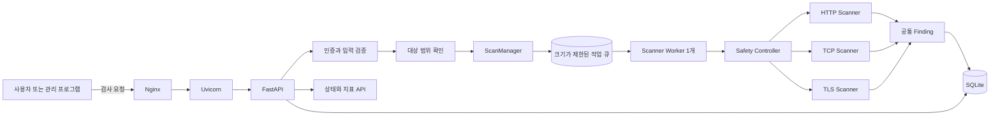
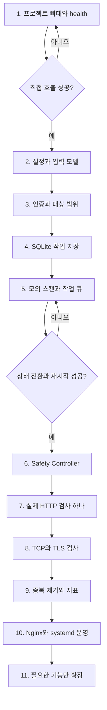
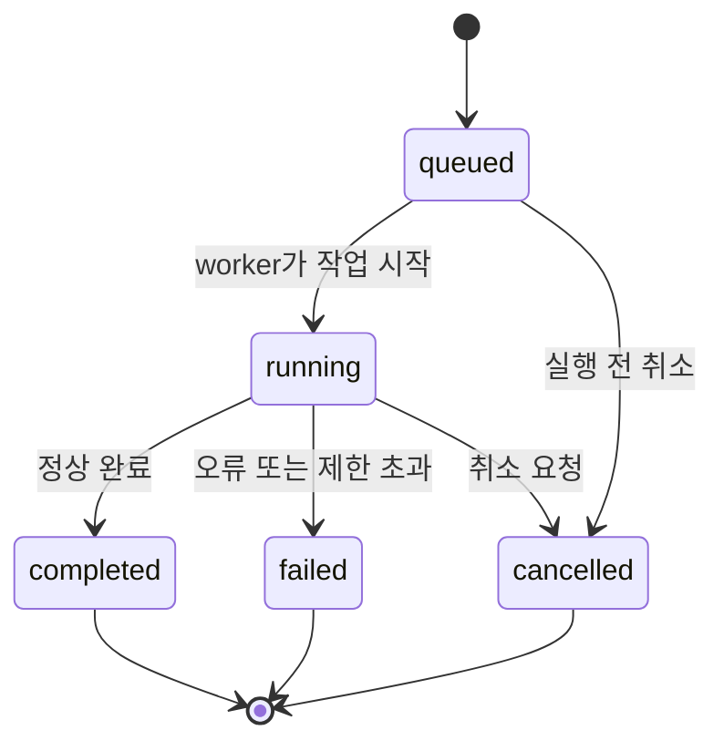

# 최종 개발 시작 가이드

> 문서 지도: [[README]] · 다음 문서: [[01 Python 구현 설계]]

## 0. 최종 결론

이 프로젝트는 Nuclei를 호출하거나 호환하는 프로그램이 아니다. Nuclei는 기존 스캐너가 구성요소를 어떻게 나누는지 공부할 때만 참고한다. 실제 제품은 Raspberry Pi OS에서 실행되는 **독립 Python 스캐너**로 만든다.

가장 먼저 만들 것은 취약점 검사 기능이 아니라 다음 한 줄의 통신 경로다.

```text
Nginx -> Uvicorn -> FastAPI -> GET /health -> {"status": "ok"}
```

그 다음에는 모의 스캔으로 작업 처리 구조를 검증하고, 안전장치를 완성한 후 실제 HTTP 검사를 하나만 추가한다.

> [!important] 개발 원칙
> 한 번에 많은 기능을 만들지 않는다. 각 단계가 실행되고 시험된 뒤 다음 단계로 넘어간다. 실제 네트워크 요청을 보내기 전에 인증, 대상 허용 범위, 요청 수, 속도, 응답 크기와 실행 시간을 제한한다.

## 1. 프로그램을 한 문장으로 설명하면

> 라즈베리파이에 연결된 허가된 컴퓨터나 기계의 네트워크 서비스를 제한된 범위에서 검사하고, 검사 상태와 결과를 API로 제공하는 독립 Python 스캐너입니다.

## 2. 먼저 결정한 제품 범위

### 첫 번째 버전에서 하는 것

- 사용자가 검사할 IP 또는 URL을 직접 입력
- HTTP/HTTPS 기본 상태 검사
- 지정한 소수의 TCP 포트 연결 확인
- TLS 인증서 정보와 만료일 확인
- 비동기 작업 등록, 상태 조회, 취소
- SQLite에 작업 상태와 요약 결과 저장
- API 인증과 허용 CIDR 검사
- 동시 실행, 초당 요청 수, 총 요청 수, 시간 제한
- 메모리, 디스크, 큐 상태 확인

### 첫 번째 버전에서 하지 않는 것

- Nuclei CLI·API·DAST 서버 연동
- OWASP ZAP 연동
- Nuclei 템플릿 호환
- 자체 DSL과 복잡한 YAML 규칙 엔진
- Payload 곱집합과 공격형 퍼징
- 전체 네트워크 자동 발견
- 전체 65,535개 포트 검사
- Scapy 기반 raw packet
- 여러 Uvicorn 프로세스와 분산 작업 큐
- 웹 대시보드

기능을 적게 잡는 이유는 라즈베리파이의 자원이 제한적이고, API·큐·DB·네트워크·보안을 한꺼번에 구현하면 오류 위치를 구분하기 어렵기 때문이다.

## 3. 장비 연결 방식에 대한 첫 선택

“라즈베리파이를 컴퓨터나 기계에 연결하면 검사한다”는 기능은 나중에 두 방향으로 나뉜다.

| 방식 | 의미 | 난이도 | 첫 버전 선택 |
|---|---|---:|---|
| 명시적 대상 입력 | 사용자가 IP 또는 URL을 직접 입력 | 낮음 | 선택 |
| 자동 장비 발견 | 라즈베리파이가 연결된 네트워크에서 장비를 자동 탐색 | 높음 | 보류 |

첫 버전은 명시적 입력을 선택한다. 자동 발견은 네트워크 인터페이스, DHCP, ARP, 여러 장비 오탐, 검사 권한 범위까지 함께 설계해야 하기 때문이다. 기본 스캔 흐름이 완성된 후 별도 기능으로 추가한다.

## 4. 최종 전체 구조



### 이렇게 나눈 이유

- **Nginx**는 외부 연결을 받고 요청 크기와 TLS 같은 웹 경계를 담당한다.
- **Uvicorn**은 FastAPI 코드를 실제 HTTP 서버로 실행한다.
- **FastAPI**는 요청, 인증, 상태 조회 같은 제품 API를 담당한다.
- **ScanManager**는 작업을 등록하고 상태와 취소를 관리한다.
- **작업 큐**는 스캔이 한꺼번에 실행되지 않게 기다리게 한다.
- **Safety Controller**는 허용 대상, 요청량, 속도, 시간과 응답 크기를 통제한다.
- **Scanner**는 한 종류의 실제 네트워크 검사만 담당한다.
- **Finding**은 서로 다른 검사 결과를 동일한 모양으로 만든다.
- **SQLite**는 재부팅 후에도 작업과 결과를 남긴다.

각 책임을 분리하면 HTTP 검사에 문제가 생겨도 API와 DB 코드를 함께 수정할 필요가 없고, 나중에 DNS 검사기를 추가해도 기존 구조를 거의 바꾸지 않는다.

## 5. 많은 선택지 중 이 기술을 쓰는 이유

### 5.1 Raspberry Pi OS

| 대안 | 판단 |
|---|---|
| Raspberry Pi OS | Raspberry Pi 하드웨어 지원과 패키지 관리가 편하고 이미 설치됨 |
| 범용 Ubuntu | 사용 가능하지만 지금 운영체제를 바꿀 이점이 작음 |
| 전용 보안 배포판 | 도구가 많지만 독립 제품 개발에는 불필요한 구성도 많음 |

운영체제 변경보다 현재 환경에서 작은 기능을 먼저 완성하는 편이 낫다.

### 5.2 Python

| 장점 | 주의점 |
|---|---|
| 개발 속도가 빠르고 네트워크·API 라이브러리가 풍부함 | CPU 계산이 많은 작업은 Go나 Rust보다 불리할 수 있음 |
| `asyncio`로 대기 시간이 많은 네트워크 작업 처리 가능 | 비동기라고 무제한 병렬 실행하면 안 됨 |
| 테스트와 유지보수가 쉬움 | 메모리와 응답 크기를 직접 제한해야 함 |

이 스캐너의 초기 작업은 CPU 계산보다 네트워크 응답 대기가 많으므로 Python이 적합하다. 나중에 성능 측정으로 특정 부분만 병목으로 확인되면 그 부분만 별도 최적화한다.

### 5.3 FastAPI

| 대안 | 선택 여부와 이유 |
|---|---|
| FastAPI | 선택. 비동기 API, Pydantic 입력 검증, 자동 API 문서가 현재 구조와 잘 맞음 |
| Flask | 단순하지만 비동기 작업과 데이터 모델을 위한 구성을 더 직접 조립해야 함 |
| Django | 사용자·관리 화면이 큰 서비스에는 좋지만 소형 스캐너 API의 첫 버전에는 범위가 큼 |
| Uvicorn만 사용 | 가능하지만 경로 처리, JSON 검증, 오류 응답과 문서를 직접 구현해야 함 |

FastAPI는 검사 엔진이 아니다. `/scans`, `/status`, `/results`를 제공하고 실제 검사는 별도 Scanner가 수행한다.

### 5.4 Uvicorn

FastAPI는 ASGI 애플리케이션이고, 이를 네트워크 서버로 실행할 프로그램이 필요하다. Uvicorn은 그 역할을 담당한다. 초기에는 프로세스 하나만 사용한다.

여러 Uvicorn worker를 사용하지 않는 이유는 각 프로세스에 별도의 메모리 큐가 생겨 작업 상태가 나뉠 수 있고 라즈베리파이 메모리도 더 사용하기 때문이다.

### 5.5 Nginx

Nginx는 필수 검사 엔진이 아니라 FastAPI 앞의 reverse proxy다.

- 외부에는 Nginx만 노출
- Uvicorn은 `127.0.0.1:8000`에만 바인딩
- 요청 본문 크기 제한
- 나중에 HTTPS 적용
- 접근 로그와 연결 정책 관리

개발 중에는 Uvicorn을 직접 시험하고, 직접 호출이 성공한 다음 Nginx를 연결한다. 두 계층을 동시에 설정하면 어느 쪽 오류인지 구분하기 어렵다.

### 5.6 Pydantic과 pydantic-settings

- **Pydantic**은 IP, URL, 포트, 요청 옵션의 모양과 범위를 검사한다.
- **pydantic-settings**는 DB 위치, worker 수, 허용 CIDR, API 키 같은 환경 설정을 코드 밖에서 관리한다.

단, Pydantic의 URL 형식 검증만으로 대상이 안전해지는 것은 아니다. DNS로 확인된 실제 IP를 정규화하고 허용 CIDR과 다시 비교해야 한다.

### 5.7 asyncio와 asyncio.Queue

`asyncio`는 네트워크 응답을 기다리는 동안 다른 작업을 진행하게 한다. `asyncio.Queue(maxsize=...)`는 접수된 스캔이 무제한 쌓이는 것을 막는다.

| 대안 | 판단 |
|---|---|
| `asyncio.Queue` | 단일 라즈베리파이 MVP에 충분하고 외부 서버가 필요 없음 |
| Celery + Redis | 여러 장비와 분산 worker가 필요할 때 유용하지만 지금은 운영 요소가 너무 많아짐 |
| FastAPI BackgroundTasks | 짧은 후처리에 적합하지만 장시간 스캔의 상태·취소·복구 관리에는 부족함 |

메모리 큐는 재부팅하면 사라지므로 작업 상태를 먼저 SQLite에 저장하고 큐에는 `scan_id`만 넣는다.

### 5.8 SQLite와 aiosqlite

| 대안 | 선택 여부와 이유 |
|---|---|
| SQLite | 선택. 파일 하나이고 별도 DB 서버가 없으며 작업·결과 조회가 쉬움 |
| JSON 파일 | 처음에는 쉬워도 동시 쓰기, 검색, 중복, 손상 복구가 어려움 |
| PostgreSQL | 다중 서버에는 좋지만 단일 라즈베리파이 MVP에는 관리 비용이 큼 |

`aiosqlite`는 비동기 코드에서 SQLite 작업을 다루기 쉽게 한다. SQLite에는 전체 응답 본문이 아니라 작업 상태와 제한된 결과만 저장한다.

### 5.9 HTTPX

HTTP 검사는 `httpx.AsyncClient`로 구현한다.

| 대안 | 판단 |
|---|---|
| HTTPX | 비동기 지원, connection pool, timeout과 연결 수 제한을 함께 제공 |
| Requests | 사용법은 단순하지만 동기 방식이 기본이라 비동기 Scanner와 바로 맞지 않음 |
| aiohttp | 좋은 비동기 라이브러리지만 FastAPI와 비슷한 사용감과 필요한 기능을 기준으로 HTTPX로 통일 |

`AsyncClient`는 요청마다 새로 만들지 않고 애플리케이션 생명주기 동안 제한된 연결 풀로 재사용한다. 응답은 스트리밍으로 읽으며 최대 크기를 넘으면 중단한다.

### 5.10 aiolimiter

`asyncio.Semaphore`는 동시에 실행할 개수를 제한하고, `aiolimiter`는 일정 시간 동안 요청을 몇 번 보낼지 제한한다. 둘은 역할이 다르므로 함께 사용한다.

```text
Semaphore = 동시에 몇 개
Rate limiter = 초당 몇 번
Request budget = 작업 전체에서 총 몇 번
Timeout = 최대 몇 초 또는 몇 분
```

전역 limiter와 `정규화된 대상 IP + 포트` 기준 limiter를 함께 둔다.

### 5.11 systemd-journald

라즈베리파이 서비스 로그는 별도 무제한 파일보다 journald를 우선 사용한다. systemd가 부팅 시 애플리케이션 시작과 실패 재시작도 담당할 수 있다.

50GB 저장 공간을 위해 로그와 결과에 상한을 둔다.

- 운영 로그 총량 제한
- 완료 결과 보존 기간 설정
- 전체 HTTP 본문 기본 미저장
- Cookie, Authorization, 토큰, 비밀번호 제거
- 디스크 여유 공간이 기준 이하일 때 새 스캔 접수 중단

### 5.12 pytest, pytest-asyncio, respx

- `pytest`: 일반 코드 시험
- `pytest-asyncio`: 비동기 함수와 worker 시험
- `respx`: 실제 외부 서버 없이 HTTPX 응답 모의 시험

Scanner는 네트워크와 실패 조건이 많으므로 수동 시험만으로 timeout, 취소, 재시작을 반복 확인하기 어렵다.

## 6. 최종 개발 순서



### 1단계: 프로젝트 뼈대와 `/health`

**만드는 것**

- 가상환경
- `app/main.py`
- FastAPI 객체
- `GET /health`
- Uvicorn 직접 실행

**먼저 하는 이유**

가장 짧은 경로로 Python, FastAPI, Uvicorn 설치와 모듈 경로가 정상인지 확인할 수 있다. 이 단계에서 DB나 Scanner를 넣으면 단순한 import 오류도 복잡하게 보인다.

**완료 조건**

```bash
curl http://127.0.0.1:8000/health
```

```json
{"status":"ok"}
```

### 2단계: 설정과 입력 모델

**만드는 것**

- `Settings`: DB 위치, worker 수, timeout, 요청 예산, 허용 CIDR
- `ScanCreate`: target, scan type, 제한된 포트 목록
- `ScanStatus`: queued, running, completed, failed, cancelled

**이유**

코드 곳곳에 숫자와 경로를 직접 적으면 설정을 변경하기 어렵다. 입력 모델을 먼저 만들면 이후 API, DB, Scanner가 같은 정의를 사용한다.

### 3단계: 인증과 대상 범위

**만드는 것**

- MVP용 관리자 API 키 하나
- API 키와 허용 CIDR 연결
- hostname을 실제 A/AAAA 주소로 확인
- IPv4-mapped IPv6 정규화
- loopback, link-local, multicast 등의 정책
- redirect 목적지 재검사 규칙

**실제 Scanner보다 먼저 만드는 이유**

네트워크 요청 코드가 생긴 뒤 범위 검사를 추가하면 실수로 허용되지 않은 대상에 요청할 수 있다. 모든 Scanner가 공통 Safety Controller를 통과하게 먼저 경계를 만든다.

### 4단계: SQLite 작업 저장

**만드는 것**

- `scans` 테이블
- `findings` 테이블
- 작업 생성·상태 변경·조회 repository
- WAL 모드와 짧은 transaction

**큐보다 먼저 하는 이유**

메모리 큐의 작업은 전원이 꺼지면 사라진다. 먼저 DB에 `queued`를 저장한 후 queue에 ID를 넣어야 재부팅 후 상태를 정리할 수 있다.

### 5단계: 모의 스캔과 작업 큐

**만드는 것**

- `POST /scans`
- `GET /scans/{id}`
- 크기가 제한된 `asyncio.Queue`
- worker 1개
- 2초 기다린 후 고정 결과를 반환하는 MockScanner

**모의 스캔을 쓰는 이유**

실제 네트워크를 제외하고 다음 흐름만 검증한다.



이 흐름이 정상이라면 실제 HTTP 검사에서 발생한 오류는 네트워크 또는 검사 규칙 쪽으로 좁혀진다.

### 6단계: Safety Controller

**만드는 것**

- 전역 동시성 제한
- 대상별 동시성 제한
- 전역 RPS와 대상별 RPS
- 작업당 총 요청 수
- 작업 전체 실행 시간
- 요청별 connect/read/write/pool timeout
- 응답 최대 바이트
- queue 최대 크기
- redirect와 retry도 요청 수에 포함

**초기 예시값**

| 제한 | 보수적 출발값 | 의미 |
|---|---:|---|
| Scanner worker | 1 | 한 번에 한 작업 처리 |
| 전역 동시 요청 | 5 | 전체 연결을 동시에 최대 5개 |
| 대상별 동시 요청 | 2 | 한 장비에 동시에 최대 2개 |
| 전역 RPS | 5 | 전체 초당 최대 5회 |
| 대상별 RPS | 2 | 한 장비 초당 최대 2회 |
| 작업당 요청 | 100 | 한 작업이 만들 수 있는 최대 요청 수 |
| 작업 시간 | 5분 | 이 시간이 지나면 중단 |
| 응답 크기 | 1MiB | 이보다 큰 본문은 읽기 중단 |

이 값은 정답이 아니라 Raspberry Pi 모델과 검사 대상에 맞춰 측정하기 위한 안전한 출발점이다.

### 7단계: 첫 실제 HTTP 검사

**처음 검사할 항목**

- 연결 성공 여부
- HTTP 상태 코드
- 응답 시간
- Content-Type
- Server 헤더가 존재할 경우 제한된 값
- redirect 위치를 따라가지 않고 기록

**HTTP를 먼저 선택한 이유**

- FastAPI와 같은 비동기 구조를 그대로 활용할 수 있음
- HTTPX로 timeout과 연결 제한을 명확히 적용 가능
- 로컬 테스트 서버로 재현하기 쉬움
- TCP, TLS, 규칙 판단, 결과 저장으로 확장할 기반이 됨

처음부터 공격 payload나 취약점 판정 전체를 만들지 않는다. 먼저 “안전하게 요청하고 제한된 응답을 저장하는 능력”을 완성한다.

### 8단계: TCP와 TLS 검사

- TCP: 사용자가 지정한 소수 포트의 연결 가능 여부
- TLS: 인증서 대상 이름, 발급자, 만료일
- 포트 수, 동시 연결 수, timeout 제한

전체 포트 자동 검사를 보류하는 이유는 요청 수와 시간이 급격히 늘고, 네트워크 정책과 오탐을 먼저 다뤄야 하기 때문이다.

### 9단계: 결과 중복 제거와 운영 지표

같은 스캔 안의 중복 키 예시:

```text
scan_id + canonical_target + rule_id + location + normalized_evidence_hash
```

서로 다른 날짜의 스캔에서 같은 문제가 다시 발견된 것은 삭제하지 않고 재발견 이력으로 남긴다.

초기 지표:

- queue 현재 크기와 최대 크기
- 실행 중인 worker 수
- 성공·실패·취소 작업 수
- 검사 시간과 timeout 수
- rate limit 대기 횟수
- 프로세스 메모리
- SQLite 크기와 남은 디스크

URL이나 IP를 metric label로 넣지 않는다. 민감정보와 metric cardinality가 커질 수 있기 때문이다.

### 10단계: Nginx와 systemd 운영

Uvicorn 직접 시험이 끝난 후에만 Nginx를 연결한다. 기능 흐름이 안정된 후 systemd로 부팅 시 자동 실행과 실패 재시작을 설정한다.

운영에서는 Uvicorn을 `127.0.0.1`에만 열고 외부에는 Nginx만 노출한다. 인증과 허용 네트워크가 완성되기 전에는 인터넷에 공개하지 않는다.

### 11단계: 필요한 기능만 확장

실제 요구가 확인된 순서로 선택한다.

- DNS 조회 검사
- WebSocket 검사
- 장비 자동 발견
- 자체 YAML 규칙
- 정규식 matcher
- 제한된 payload 조합
- 관리 화면

자체 YAML을 만들더라도 Nuclei 호환을 목표로 하지 않는다. 자유로운 문자열 DSL보다 `field`, `operator`, `value`처럼 구조화된 규칙을 먼저 사용한다.

## 7. 오늘 실제로 시작할 작업

현재 Raspberry Pi OS, Python, FastAPI, Nginx 설치가 끝났으므로 오늘은 다음까지만 한다.

### 7.1 설치 확인

```bash
python3 --version
nginx -v
python3 -m pip --version
```

### 7.2 프로젝트 생성

```bash
mkdir -p ~/scanner-project/app
cd ~/scanner-project
python3 -m venv .venv
source .venv/bin/activate
python -m pip install --upgrade pip
python -m pip install fastapi "uvicorn[standard]" pydantic-settings
```

첫날에는 아직 `httpx`, `aiosqlite`, `aiolimiter`가 없어도 된다. 실제로 사용하는 단계에서 하나씩 추가하면 각 패키지의 용도를 분명히 알 수 있다.

### 7.3 첫 파일

`app/main.py`:

```python
from fastapi import FastAPI


app = FastAPI(title="Raspberry Pi Scanner")


@app.get("/health")
async def health() -> dict[str, str]:
    return {"status": "ok"}
```

빈 `app/__init__.py`도 만든다.

### 7.4 실행

```bash
cd ~/scanner-project
source .venv/bin/activate
python -m uvicorn app.main:app --host 127.0.0.1 --port 8000
```

다른 터미널:

```bash
curl http://127.0.0.1:8000/health
```

오늘의 완료 기준은 `/health`가 정상 응답하는 것이다. 아직 Nginx 설정, DB, 모의 스캔, 실제 검사를 한꺼번에 시작하지 않는다.

## 8. 권장 폴더 구조

최종 형태를 처음부터 모두 채우지 말고 단계마다 파일을 추가한다.

```text
scanner-project/
├─ app/
│  ├─ main.py
│  ├─ settings.py
│  ├─ api/
│  │  └─ scans.py
│  ├─ schemas/
│  │  ├─ scan.py
│  │  └─ finding.py
│  ├─ services/
│  │  ├─ scan_manager.py
│  │  ├─ safety.py
│  │  └─ scope.py
│  ├─ scanners/
│  │  ├─ base.py
│  │  ├─ mock_scanner.py
│  │  ├─ http_scanner.py
│  │  ├─ tcp_scanner.py
│  │  └─ tls_scanner.py
│  ├─ repositories/
│  │  └─ scans.py
│  └─ db.py
├─ tests/
├─ data/
├─ pyproject.toml
└─ .env.example
```

## 9. 핵심 용어 사전

| 용어 | 쉬운 뜻 | 이 프로그램에서의 의미 |
|---|---|---|
| API | 프로그램끼리 요청하고 응답하는 약속 | 스캔 생성·상태·결과 주소 |
| FastAPI | Python API 제작 도구 | API 경로, 입력 검증, JSON 응답 |
| ASGI | Python 비동기 웹 앱과 서버 사이의 표준 | FastAPI와 Uvicorn이 대화하는 규격 |
| Uvicorn | ASGI 웹서버 | FastAPI를 실행하고 HTTP 연결 처리 |
| Nginx | reverse proxy 웹서버 | 외부 요청을 받고 Uvicorn으로 전달 |
| Reverse proxy | 앞에서 요청을 받아 내부 서버로 넘기는 구성 | Uvicorn을 직접 외부에 노출하지 않음 |
| Scanner | 실제 검사 모듈 | HTTP, TCP, TLS 요청과 결과 판단 |
| ScanManager | 검사 작업 관리자 | 등록, 상태, 취소, Scanner 선택 |
| Worker | 대기 중인 작업을 실행하는 실행자 | queue에서 작업을 하나씩 가져감 |
| Queue | 작업 대기 줄 | 작업 폭주와 동시 실행을 제한 |
| 비동기 | 기다리는 동안 다른 일을 처리하는 방식 | 네트워크 응답 대기 시간을 효율적으로 사용 |
| 동시성 | 같은 시간 구간에 여러 작업을 처리하는 구조 | 병렬 개수는 제한해야 함 |
| Semaphore | 동시에 실행 가능한 개수 제한 | 연결과 검사 수를 제한 |
| Rate limit | 일정 시간의 요청 횟수 제한 | 초당 요청 수 제한 |
| Request budget | 작업 전체의 총 요청 수 제한 | 끝나지 않는 검사 방지 |
| Timeout | 기다릴 수 있는 최대 시간 | 멈춘 연결과 작업 종료 |
| CIDR | IP 주소 범위를 표현하는 방식 | 검사 가능한 네트워크 범위 |
| Scope | 검사하도록 허용된 대상 범위 | CIDR과 사용자 권한으로 결정 |
| Finding | 검사에서 발견한 하나의 결과 | 엔진과 상관없는 공통 결과 모델 |
| Deduplication | 같은 결과를 중복 저장하지 않는 처리 | 같은 스캔의 동일 결과 병합 |
| SQLite | 파일 기반 관계형 DB | 작업 상태와 결과 저장 |
| WAL | SQLite의 쓰기 기록 방식 | 읽기와 쓰기의 충돌을 줄임 |
| Mock Scan | 실제 요청이 없는 모의 작업 | API·큐·DB 상태 흐름 시험 |
| Observability | 내부 상태를 밖에서 확인하는 능력 | 큐, worker, 오류, 메모리, 디스크 지표 |
| MVP | 가장 작은 동작 가능한 첫 버전 | 명시적 대상의 HTTP/TCP/TLS 기본 검사 |
| DSL | 규칙을 표현하는 전용 문법 | 첫 버전에서는 만들지 않음 |
| ReDoS | 복잡한 정규식으로 CPU를 오래 점유하는 문제 | 정규식 기능을 추가할 때 방어 필요 |

## 10. 다음 단계로 넘어가기 위한 체크리스트

```text
[ ] /health 직접 호출 성공
[ ] 설정과 요청 모델의 자동 테스트 성공
[ ] API 키가 없으면 스캔 API 거부
[ ] 허용 CIDR 밖 대상 거부
[ ] SQLite에 queued 작업 저장
[ ] 모의 스캔 상태가 queued -> running -> completed로 변화
[ ] 재시작 후 이전 작업 조회 가능
[ ] queue, 요청 수, 속도, 시간, 응답 크기 제한 적용
[ ] 로컬 테스트 서버 대상으로 HTTP Scanner 성공
[ ] 취소·timeout·실패 테스트 성공
[ ] Nginx를 통한 인증된 접근 성공
[ ] systemd 재시작과 로그 제한 확인
```

## 11. 참고한 공식 문서

- [FastAPI 서버 실행과 ASGI 서버](https://fastapi.tiangolo.com/deployment/manually/)
- [FastAPI 배포 개념과 자동 시작](https://fastapi.tiangolo.com/deployment/concepts/)
- [FastAPI 큰 애플리케이션의 파일 분리](https://fastapi.tiangolo.com/tutorial/bigger-applications/)
- [HTTPX 비동기 지원과 Client 재사용](https://www.python-httpx.org/async/)
- [HTTPX timeout](https://www.python-httpx.org/advanced/timeouts/)
- [HTTPX connection pool 제한](https://www.python-httpx.org/advanced/resource-limits/)
- [Python asyncio.Queue](https://docs.python.org/3/library/asyncio-queue.html)
- [Python ipaddress](https://docs.python.org/3/library/ipaddress.html)

## 최종 방향 요약

```text
오늘
  /health 하나를 Uvicorn으로 실행

그다음
  설정 -> 인증·범위 -> SQLite -> 모의 스캔

실제 요청 전
  동시성 -> 속도 -> 총 요청 수 -> timeout -> 응답 크기 제한

첫 실제 기능
  HTTP 기본 검사 하나

이후
  TCP -> TLS -> 중복 제거 -> 지표 -> Nginx/systemd

나중에 필요할 때만
  DNS -> 자동 발견 -> 자체 YAML/DSL -> 관리 화면
```
