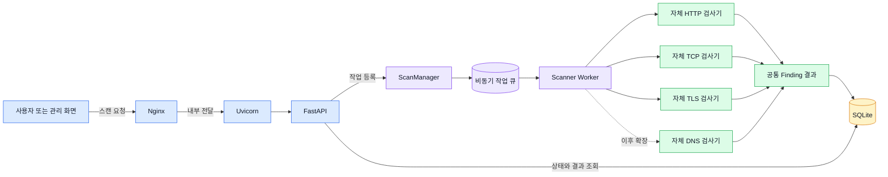
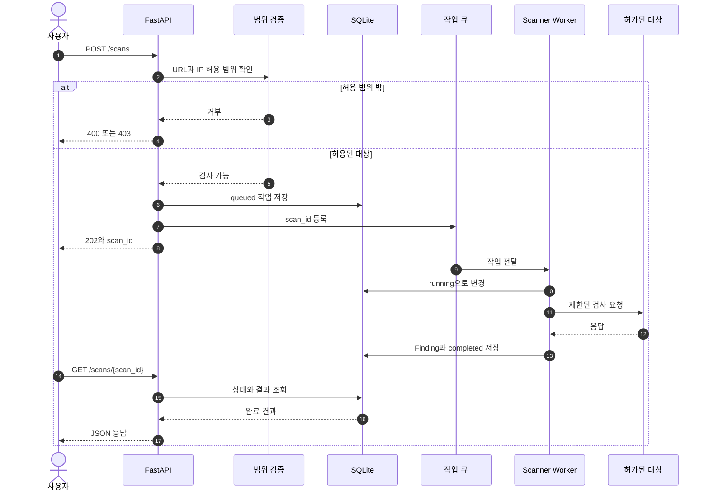

# 1. Python 구현 설계

> 이전 문서: [[00 최종 개발 시작 가이드]] · 다음 문서: [[02 비동기 작업과 저장 정책]] · 처음으로: [[README]]

## 문서의 목적

이 문서는 라즈베리파이용 **독립 Python 스캐너**를 어떻게 구현할지 설명한다. Nuclei는 기존 스캐너의 구성 방식을 조사하기 위한 참고 자료일 뿐이며, 완성 프로그램에서 Nuclei 코드·CLI·DAST 서버·템플릿을 호출하거나 연동하지 않는다.

첫 버전의 목표는 다음으로 제한한다.

- FastAPI로 스캔 요청 접수·상태·결과 API 제공
- HTTP/HTTPS와 기본 TCP 연결 검사
- 비동기 작업 큐와 동시 실행 제한
- SQLite에 상태와 결과 요약 저장
- 자체 Python 검사 모듈과 자체 결과 형식 사용
- 50GB 저장 공간을 고려한 로그 순환과 결과 보존
- 허용된 IP/CIDR만 검사

## 한눈에 보는 프로그램 구조



색상의 의미는 파란색이 웹 요청 처리, 보라색이 작업 관리, 초록색이 자체 검사 기능, 노란색이 저장소다. Nuclei나 ZAP은 실행 구조에 포함되지 않는다.

## 1. 권장 프로젝트 구조

```text
scanner_project/
├─ app/
│  ├─ main.py                 # FastAPI 생성과 시작·종료 처리
│  ├─ settings.py             # 환경 설정
│  ├─ api/
│  │  └─ scans.py             # /scans API
│  ├─ schemas/
│  │  ├─ scan.py              # 요청·응답 Pydantic 모델
│  │  └─ finding.py           # 탐지 결과 모델
│  ├─ services/
│  │  ├─ scan_manager.py      # 큐, worker, 취소, 상태 전환
│  │  └─ scope.py             # 허용 대상 검증
│  ├─ scanners/
│  │  ├─ base.py              # 모든 검사기의 공통 규격
│  │  ├─ http_probe.py        # HTTP/HTTPS 검사
│  │  ├─ tcp_probe.py         # TCP 연결·배너 검사
│  │  ├─ tls_probe.py         # TLS 인증서 검사
│  │  └─ dns_probe.py         # 이후 추가할 DNS 검사
│  ├─ repositories/
│  │  └─ scans.py             # SQLite 읽기·쓰기
│  ├─ db.py                   # DB 초기화와 연결
│  └─ logging_config.py       # 로그 출력과 순환 정책
├─ tests/
├─ templates/                 # 직접 만든 안전한 YAML 템플릿
├─ data/                      # SQLite DB
├─ pyproject.toml
└─ .env.example
```

API, 작업 관리, 검사 실행, DB 저장을 분리하면 한 파일이 지나치게 커지는 것을 막고 자체 프로토콜 검사 기능을 독립적으로 확장할 수 있다.

## 2. 전체 실행 흐름



```text
POST /scans
  -> Pydantic 입력 검증
  -> 대상 주소와 허용 범위 검증
  -> SQLite에 queued 상태 저장
  -> asyncio.Queue에 scan_id 입력
  -> 즉시 202 응답

worker
  -> 큐에서 scan_id 꺼냄
  -> 상태를 running으로 변경
  -> 선택된 검사기 실행
  -> 결과를 공통 Finding 형식으로 변환
  -> SQLite에 결과와 completed 상태 저장
  -> 실패 시 오류 요약과 failed 상태 저장
```

HTTP 요청 하나가 끝날 때까지 API 연결을 계속 유지하지 않는다. API는 작업 ID를 먼저 돌려주고 사용자는 상태 API로 진행 상황을 확인한다.

## 3. 설치 패키지

첫 버전에 필요한 최소 패키지는 다음과 같다.

```text
fastapi
uvicorn[standard]
pydantic
pydantic-settings
httpx
aiolimiter
aiosqlite
PyYAML
```

개발·시험용 패키지:

```text
pytest
pytest-asyncio
respx
```

`asyncio`, `ssl`, `ipaddress`, `logging`, `subprocess`에 해당하는 기능은 Python 표준 라이브러리에 포함되므로 별도로 설치하지 않는다.

## 4. 환경 설정

```python
# app/settings.py
from pydantic import Field
from pydantic_settings import BaseSettings, SettingsConfigDict


class Settings(BaseSettings):
    model_config = SettingsConfigDict(env_file=".env", extra="ignore")

    database_path: str = "data/scanner.db"
    worker_count: int = Field(default=1, ge=1, le=4)
    queue_size: int = Field(default=100, ge=1, le=1000)
    request_timeout_seconds: float = Field(default=10, gt=0, le=60)
    max_response_bytes: int = Field(default=1_000_000, ge=1024)
    requests_per_second: int = Field(default=5, ge=1, le=100)
    allowed_cidrs: list[str] = ["192.168.0.0/16"]
    result_retention_days: int = Field(default=30, ge=1)


settings = Settings()
```

라즈베리파이 초기값은 worker 1개, 초당 요청 5개처럼 보수적으로 시작한다. 실제 측정 후에만 높인다.

## 5. API 데이터 모델

```python
# app/schemas/scan.py
from enum import StrEnum
from uuid import UUID

from pydantic import AnyHttpUrl, BaseModel, Field


class ScanType(StrEnum):
    HTTP = "http"
    TCP = "tcp"
    TLS = "tls"
    DNS = "dns"


class ScanStatus(StrEnum):
    QUEUED = "queued"
    RUNNING = "running"
    COMPLETED = "completed"
    FAILED = "failed"
    CANCELLED = "cancelled"


class ScanCreate(BaseModel):
    target: AnyHttpUrl
    scan_type: ScanType = ScanType.HTTP
    ports: list[int] = Field(default_factory=list, max_length=100)


class ScanAccepted(BaseModel):
    scan_id: UUID
    status: ScanStatus
```

Pydantic 검증만으로 대상이 안전하다고 판단하면 안 된다. URL 형식 검사 후 실제 IP를 확인하고 허용 CIDR 밖이면 거부해야 한다.

## 6. 허용 범위 검증

```python
# app/services/scope.py
import asyncio
import ipaddress
from urllib.parse import urlsplit


async def resolve_allowed_ips(url: str, allowed_cidrs: list[str]):
    hostname = urlsplit(url).hostname
    if not hostname:
        raise ValueError("대상 호스트가 없습니다.")

    loop = asyncio.get_running_loop()
    records = await loop.getaddrinfo(hostname, None)
    resolved = {ipaddress.ip_address(item[4][0]) for item in records}
    networks = [ipaddress.ip_network(value) for value in allowed_cidrs]

    if not resolved or any(
        not any(address in network for network in networks)
        for address in resolved
    ):
        raise ValueError("허용 범위 밖의 대상입니다.")

    return resolved
```

실제 구현에서는 redirect가 발생한 목적지도 다시 검증한다. DNS 재조회로 IP가 달라지는 경우, localhost, link-local, 클라우드 metadata 주소 등도 정책에 따라 차단한다.

## 7. 검사 결과 공통 형식

HTTP, TCP, TLS 등 직접 만든 검사 결과를 한 화면에서 보여주려면 공통 모델로 변환해야 한다.

```python
# app/schemas/finding.py
from datetime import datetime
from typing import Any

from pydantic import BaseModel, Field


class Finding(BaseModel):
    engine: str
    rule_id: str
    target: str
    severity: str
    title: str
    evidence: dict[str, Any] = Field(default_factory=dict)
    detected_at: datetime
```

`evidence`에는 비밀번호, 세션 쿠키, 전체 응답 본문을 넣지 않는다. 필요한 헤더나 짧게 제한한 일부 증거만 저장한다.

## 8. 검사기 공통 인터페이스

```python
# app/scanners/base.py
from typing import Protocol

from app.schemas.finding import Finding
from app.schemas.scan import ScanCreate


class Scanner(Protocol):
    async def scan(self, request: ScanCreate) -> list[Finding]:
        ...
```

HTTP, TCP, TLS, DNS 검사기가 모두 같은 `scan()` 형태를 사용하면 `ScanManager`는 내부 구현을 몰라도 선택한 검사기를 실행할 수 있다.

## 9. HTTP 검사기

```python
# app/scanners/http_probe.py
import httpx
from aiolimiter import AsyncLimiter


class HttpProbe:
    def __init__(self, client: httpx.AsyncClient, limiter: AsyncLimiter):
        self.client = client
        self.limiter = limiter

    async def fetch(self, url: str) -> httpx.Response:
        async with self.limiter:
            return await self.client.get(url, follow_redirects=False)
```

`httpx.AsyncClient`는 요청마다 새로 만들지 않고 애플리케이션 실행 중 재사용한다. timeout, 연결 수, 최대 응답 크기를 반드시 제한한다. redirect는 자동으로 따라가지 않고 새 목적지가 허용 범위인지 확인한 후 처리한다.

## 10. TCP 검사기

```python
# app/scanners/tcp_probe.py
import asyncio


async def check_tcp(host: str, port: int, timeout: float = 3.0) -> bool:
    try:
        reader, writer = await asyncio.wait_for(
            asyncio.open_connection(host, port),
            timeout=timeout,
        )
        writer.close()
        await writer.wait_closed()
        return True
    except (TimeoutError, OSError):
        return False
```

많은 포트를 한꺼번에 `gather()`로 실행하지 않는다. `asyncio.Semaphore`로 동시 연결 수를 제한하고 검사할 포트 개수에도 상한을 둔다.

## 11. 비동기 작업 큐

긴 스캔을 FastAPI 요청 함수 안에서 직접 실행하지 않는다. 초기 단일 장비 버전은 `asyncio.Queue`와 고정된 worker 수로 구현할 수 있다.

```python
# 핵심 구조를 보여주기 위한 축약 예시
class ScanManager:
    def __init__(self, max_queue_size: int):
        self.queue: asyncio.Queue[str] = asyncio.Queue(maxsize=max_queue_size)
        self.workers: list[asyncio.Task] = []

    async def submit(self, scan_id: str) -> None:
        self.queue.put_nowait(scan_id)

    async def worker(self) -> None:
        while True:
            scan_id = await self.queue.get()
            try:
                await self.run_scan(scan_id)
            finally:
                self.queue.task_done()
```

큐가 가득 찼다면 무한히 기다리지 말고 API에서 `503 Service Unavailable` 또는 `429 Too Many Requests`를 반환한다.

메모리 큐는 재부팅하면 사라진다. 따라서 작업을 큐에 넣기 전에 SQLite에 저장하고, 시작할 때 이전 `running` 작업을 `failed` 또는 재시도 상태로 정리한다. 제품 규모가 커질 때만 별도의 Redis/Celery 같은 외부 큐를 검토한다.

## 12. FastAPI와 생명주기

```python
# app/main.py의 구조 예시
from contextlib import asynccontextmanager

import httpx
from fastapi import FastAPI


@asynccontextmanager
async def lifespan(app: FastAPI):
    app.state.http_client = httpx.AsyncClient(
        timeout=10.0,
        limits=httpx.Limits(max_connections=20),
    )
    await initialize_database()
    await scan_manager.start()
    try:
        yield
    finally:
        await scan_manager.stop()
        await app.state.http_client.aclose()


app = FastAPI(lifespan=lifespan)
```

초기 라즈베리파이에서는 Uvicorn worker를 1개만 사용한다. 여러 Uvicorn 프로세스를 띄우면 각 프로세스가 별도 메모리 큐를 만들어 작업 상태가 분리될 수 있다.

## 13. API 엔드포인트

| API | 역할 |
|---|---|
| `POST /scans` | 스캔 작업 생성, `scan_id` 즉시 반환 |
| `GET /scans/{scan_id}` | 작업 상태와 진행 정보 확인 |
| `GET /scans/{scan_id}/results` | 탐지 결과 목록 조회 |
| `POST /scans/{scan_id}/cancel` | 대기 또는 실행 중인 작업 취소 요청 |
| `GET /health` | API, DB, worker 상태 확인 |

작업 생성 API는 검사를 완료한 결과가 아니라 `202 Accepted`와 작업 ID를 반환한다.

## 14. SQLite 테이블

```sql
CREATE TABLE scans (
    id TEXT PRIMARY KEY,
    target TEXT NOT NULL,
    scan_type TEXT NOT NULL,
    status TEXT NOT NULL,
    created_at TEXT NOT NULL,
    started_at TEXT,
    finished_at TEXT,
    error_summary TEXT
);

CREATE TABLE findings (
    id INTEGER PRIMARY KEY AUTOINCREMENT,
    scan_id TEXT NOT NULL,
    engine TEXT NOT NULL,
    rule_id TEXT NOT NULL,
    severity TEXT NOT NULL,
    title TEXT NOT NULL,
    target TEXT NOT NULL,
    evidence_json TEXT NOT NULL,
    detected_at TEXT NOT NULL,
    FOREIGN KEY (scan_id) REFERENCES scans(id)
);
```

SQLite는 WAL 모드를 사용하고 쓰기 작업을 짧은 transaction으로 처리한다. 요청·응답 원문을 대량으로 DB에 넣지 않는다.

## 15. 자체 검사 엔진 구현

이 프로그램은 외부 스캐너를 호출하는 래퍼가 아니다. `ScanManager`가 직접 만든 Python 검사기를 선택하고 실행한다.

```text
ScanManager
  -> HttpScanner
      -> 요청 작성
      -> httpx로 전송
      -> 응답 정규화
      -> 검사 규칙 적용
      -> Finding 반환
  -> TcpScanner
      -> asyncio로 연결
      -> 연결 상태와 제한된 배너 확인
      -> Finding 반환
  -> TlsScanner
      -> ssl로 연결
      -> 인증서 정보 확인
      -> Finding 반환
```

검사기는 다음 책임만 갖는다.

1. 검증된 대상과 옵션을 받는다.
2. 제한된 네트워크 요청을 보낸다.
3. 응답을 공통 형식으로 정리한다.
4. 자체 규칙으로 결과를 판단한다.
5. `Finding` 목록을 반환한다.

대상 허용 범위, 작업 상태, 저장, 로그, 취소는 검사기 안에 중복 구현하지 않고 `ScanManager`와 공통 서비스가 담당한다.

## 16. 자체 규칙과 템플릿

첫 버전은 YAML 템플릿 엔진부터 만들지 않고 Python 함수로 소수의 규칙을 구현한다.

```python
def missing_security_headers(headers: dict[str, str]) -> list[str]:
    required = {
        "content-security-policy",
        "x-content-type-options",
    }
    normalized = {name.lower() for name in headers}
    return sorted(required - normalized)
```

규칙 수가 많아져 반복 구조가 확인된 뒤에만 자체 YAML 형식을 추가한다. YAML 구조는 이 프로그램의 요구사항에 맞게 새로 정의하며 Nuclei 템플릿 호환을 목표로 하지 않는다.

```yaml
id: missing-security-headers
protocol: http
checks:
  - type: header-absent
    name: content-security-policy
    severity: low
```

템플릿을 도입할 때도 임의 Python, shell 명령, 파일 경로를 실행할 수 없게 한다. 허용된 필드와 검사 연산만 Pydantic 모델로 검증한다.

## 17. 로깅과 50GB 저장 공간

운영 서비스 로그는 Raspberry Pi OS의 `systemd-journald`를 기본으로 사용한다. 파일 로그가 꼭 필요하면 `RotatingFileHandler`로 크기와 개수를 제한한다.

예시 정책:

- 애플리케이션 로그: 파일당 5MB, 최대 3개
- SQLite: 상태와 탐지 결과 요약만 저장
- 전체 HTTP 본문: 기본 저장 안 함
- 탐지 증거: 민감정보 제거 후 길이 제한
- 임시 파일: 작업 종료 시 즉시 삭제
- 완료 결과: 기본 30일 후 삭제
- 디스크 여유 공간이 기준 이하이면 새 검사 접수 중단

로그에 API 키, Authorization 헤더, Cookie, 비밀번호를 남기지 않는다.

## 18. 취소와 종료 처리

- 대기 중인 작업은 상태를 `cancelled`로 바꾸고 worker가 실행하지 않게 한다.
- Python 검사에는 `asyncio.Event`를 전달해 반복 단계 사이에서 취소 여부를 확인한다.
- 각 검사기는 반복 단계 사이에서 취소 신호를 확인하고 열어 둔 연결을 정리한다.
- 프로그램 종료 시 새 작업 접수를 막고 실행 중인 작업과 DB transaction을 정리한다.

## 19. 테스트 방법

실제 외부 장비 대신 로컬 테스트 서버와 가짜 응답을 사용한다.

- `respx`: HTTPX 응답 모의 시험
- `pytest-asyncio`: 비동기 함수와 worker 시험
- 임시 SQLite DB: 저장·상태 전환 시험
- 가짜 Scanner: 성공, timeout, 오류, 취소 상황 시험
- 핵심 상태 전환: `queued -> running -> completed/failed/cancelled`
- 범위 검증: 허용 IP, 차단 IP, redirect, DNS 변경 시험

검사 규칙 시험은 외부 대상을 사용하지 않고 로컬 테스트 서버와 고정된 모의 응답으로 수행한다.

## 20. 단계별 구현 순서

### 1단계: API와 저장

- 설정 모델
- SQLite 스키마와 repository
- `/scans`, `/status`, `/results`
- 작업 상태 전환

### 2단계: 비동기 실행

- 크기 제한이 있는 `asyncio.Queue`
- worker 1개
- timeout, 취소, 정상 종료
- 속도와 동시 연결 제한

### 3단계: 기본 검사

- HTTP 상태, 헤더, TLS 인증서 확인
- 제한된 TCP 포트 연결 확인
- 공통 Finding 변환

### 4단계: 자체 검사 규칙

- HTTP 응답을 공통 모델로 정규화
- 소수의 Python 검사 함수 구현
- 결과를 공통 `Finding`과 SQLite 형식으로 변환
- 로컬 테스트 서버와 모의 응답으로 검증

### 5단계: 운영 안정성

- 인증과 허용 CIDR 정책
- 로그 필터링과 보존 기간
- 디스크 여유 공간 검사
- systemd 서비스 등록
- 재부팅 후 작업 상태 복구

### 6단계: 선택 확장

- DNS, WebSocket, Raw HTTP
- 자체 YAML 규칙 형식
- 규칙 버전과 호환성 관리
- Scapy 기반 패킷 검사

## 최종 구현 원칙

> FastAPI는 요청과 작업을 관리하고, ScanManager는 검사를 순서대로 실행하며, 각 Scanner는 하나의 검사 방식만 담당하고, SQLite는 상태와 요약 결과만 저장한다. 모든 대상은 실행 직전에 허용 범위를 확인하고 라즈베리파이의 자원을 넘지 않도록 큐·동시성·속도·시간·저장량을 제한한다.
