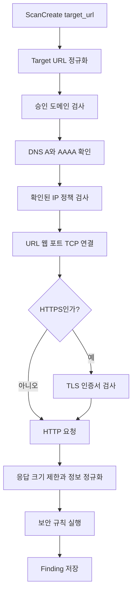
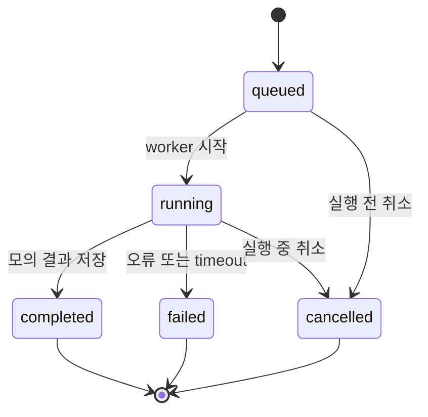

# 웹사이트 검사 Python 구현 설계

> 이전 문서: [[00 웹사이트 네트워크 스캐너 최종 가이드]] · 다음 문서: [[02 비동기 작업과 저장 정책]] · 처음으로: [[README]]

## 구현 목표

사용자가 제출한 HTTP/HTTPS URL 하나를 대상으로 DNS, 웹 포트, TLS, HTTP 응답과 수동적 웹 보안 규칙을 순서대로 실행한다. 첫 버전은 크롤링, 로그인, 공격 payload와 전체 포트 스캔을 포함하지 않는다.

## 프로젝트 구조

```text
website-scanner/
├─ app/
│  ├─ main.py
│  ├─ settings.py
│  ├─ api/
│  │  └─ scans.py
│  ├─ schemas/
│  │  ├─ target.py
│  │  ├─ scan.py
│  │  └─ finding.py
│  ├─ services/
│  │  ├─ scan_manager.py
│  │  ├─ target_guard.py
│  │  ├─ rate_limits.py
│  │  └─ request_budget.py
│  ├─ core/
│  │  ├─ engine.py
│  │  ├─ context.py
│  │  ├─ models.py
│  │  └─ errors.py
│  ├─ scanners/
│  │  ├─ dns_resolver.py
│  │  ├─ web_port_probe.py
│  │  ├─ tls_inspector.py
│  │  └─ http_inspector.py
│  ├─ rules/
│  │  ├─ security_headers.py
│  │  ├─ cookies.py
│  │  └─ tls_rules.py
│  ├─ repositories/
│  │  └─ scans.py
│  ├─ db.py
│  └─ logging_config.py
├─ tests/
├─ data/
├─ pyproject.toml
└─ .env.example
```

## 코드가 동작하는 흐름



## 필수 Python 패키지

| 용도         | 선택                                  | 이유                                          |
| ---------- | ----------------------------------- | ------------------------------------------- |
| API        | `fastapi`                           | 비동기 API와 Pydantic 입력 모델 사용                  |
| 서버         | `uvicorn`                           | FastAPI ASGI 애플리케이션 실행                      |
| 설정         | `pydantic-settings`                 | 환경변수 기반 설정 관리                               |
| HTTP/HTTPS | `httpx`                             | 비동기 요청, timeout, connection pool, streaming |
| 작업 큐       | Python `asyncio`                    | 단일 Raspberry Pi에서 외부 queue 서버 없이 실행         |
| 속도 제한      | `aiolimiter`                        | 초당 요청 수 제한                                  |
| 저장         | `aiosqlite`                         | SQLite 비동기 접근                               |
| 시험         | `pytest`, `pytest-asyncio`, `respx` | 비동기 코드와 HTTP 응답 모의 시험                       |

처음에는 `PyYAML`, `lxml`, `jmespath`, `Scapy`를 설치하지 않는다. YAML 규칙, HTML 크롤링, 복잡한 JSON 추출과 raw packet 기능이 아직 없기 때문이다.

## 설정 모델

```python
from pydantic import Field
from pydantic_settings import BaseSettings, SettingsConfigDict


class Settings(BaseSettings):
    model_config = SettingsConfigDict(env_file=".env", extra="ignore")

    database_path: str = "data/scanner.db"
    api_key: str
    approved_domains: list[str] = []
    approved_private_cidrs: list[str] = []

    scan_worker_count: int = Field(default=1, ge=1, le=2)
    queue_size: int = Field(default=50, ge=1, le=500)
    max_requests_per_scan: int = Field(default=20, ge=1, le=200)
    max_redirects: int = Field(default=3, ge=0, le=10)
    max_response_bytes: int = Field(default=1_048_576, ge=1024)
    scan_timeout_seconds: int = Field(default=120, ge=10, le=1800)
    per_origin_requests_per_second: int = Field(default=2, ge=1, le=20)
```

기본 요청 예산을 작게 잡는 이유는 첫 버전이 URL 한 개만 검사하기 때문이다. 크롤러를 추가할 때 별도 profile과 상한을 설계한다.

## API 입력 모델

```python
from enum import StrEnum

from pydantic import AnyHttpUrl, BaseModel


class ScanProfile(StrEnum):
    BASIC = "basic"


class ScanCreate(BaseModel):
    target_url: AnyHttpUrl
    profile: ScanProfile = ScanProfile.BASIC
```

추가 validator에서 다음을 거부한다.

- `http`, `https` 이외 scheme
- hostname이 없는 URL
- username 또는 password가 들어간 URL
- 지나치게 긴 URL
- 정책상 허용하지 않은 명시적 포트

## 작업 API

| Method와 경로 | 역할 |
|---|---|
| `POST /scans` | URL 검사 작업 생성, 202와 scan_id 반환 |
| `GET /scans/{scan_id}` | queued, running, completed, failed, cancelled 상태 확인 |
| `GET /scans/{scan_id}/results` | 단계별 결과와 Finding 조회 |
| `POST /scans/{scan_id}/cancel` | 대기 또는 실행 중 작업 취소 요청 |
| `GET /health` | API 프로세스 생존 확인 |
| `GET /ready` | DB와 worker가 작업을 받을 수 있는지 확인 |

## Target Guard

Target Guard는 Scanner보다 먼저 호출되며 모든 redirect에서도 다시 호출된다.

```text
URL 문법 확인
  -> hostname 정규화
  -> 승인 도메인 확인
  -> DNS A/AAAA 확인
  -> IP 정규화
  -> 차단 주소 확인
  -> 검사 origin 확정
```

확인할 IP 속성:

- loopback
- link-local
- multicast
- unspecified
- 정책상 차단한 private·reserved 주소
- IPv4-mapped IPv6의 실제 IPv4 주소

내부 웹사이트를 검사해야 한다면 모든 private IP를 풀어주는 것이 아니라 관리자가 명시한 `approved_private_cidrs`만 허용한다.

## 단계별 결과 모델

```python
from datetime import datetime
from typing import Any, Literal

from pydantic import BaseModel, Field


class StepResult(BaseModel):
    step: Literal["dns", "tcp", "tls", "http", "rules"]
    status: Literal["ok", "warning", "failed", "skipped"]
    duration_ms: int
    data: dict[str, Any] = Field(default_factory=dict)


class Finding(BaseModel):
    rule_id: str
    severity: Literal["info", "low", "medium", "high", "critical"]
    category: str
    title: str
    target_url: str
    evidence: dict[str, Any] = Field(default_factory=dict)
    detected_at: datetime
```

`StepResult`는 DNS와 TLS 중 어느 단계가 실패했는지 설명하고, `Finding`은 보안 규칙이 발견한 결과를 나타낸다.

## WebScan Pipeline 인터페이스

실제 Core 책임, 파일 분리와 실행 가능한 뼈대는 [[01-1 Core 엔진 구현 설계]]에서 설명한다. 아래 코드는 구성요소 관계만 보여주는 축약 예시다.

```python
class WebScanPipeline:
    async def scan(self, request: ScanCreate) -> tuple[list[StepResult], list[Finding]]:
        target = await self.target_guard.validate(request.target_url)
        dns_result = await self.dns_resolver.resolve(target)
        tcp_result = await self.web_port_probe.check(target)

        tls_result = None
        if target.scheme == "https":
            tls_result = await self.tls_inspector.inspect(target)

        http_result = await self.http_inspector.fetch(target)
        findings = self.rule_engine.evaluate(target, tls_result, http_result)
        return [dns_result, tcp_result, tls_result, http_result], findings
```

실제 구현에서는 각 단계 전에 요청 예산, 취소 신호와 전체 timeout을 확인하고 실패한 단계에 따라 뒤의 단계를 `skipped` 처리한다.

## DNS Resolver

초기에는 `asyncio.getaddrinfo()`를 사용한다. 결과의 모든 A/AAAA 주소를 정책 검사하며 첫 번째 주소만 보고 허용하지 않는다.

DNS 결과에는 다음만 저장한다.

- 정규화된 hostname
- IPv4와 IPv6 주소 목록
- 조회 시간
- 오류 종류

DNS 응답 전체와 불필요한 디버그 정보는 저장하지 않는다.

## Web Port Probe

URL에서 유효 포트를 계산한다.

```python
def effective_port(scheme: str, explicit_port: int | None) -> int:
    if explicit_port is not None:
        return explicit_port
    return 443 if scheme == "https" else 80
```

`asyncio.open_connection()`을 timeout으로 감싸 연결 가능 여부와 연결 시간만 확인한다. 사용자가 임의의 포트 목록을 제출하는 API는 첫 버전에서 제공하지 않는다.

## TLS Inspector

HTTPS일 때 Python 표준 `ssl`과 비동기 연결을 사용한다.

확인 결과:

- 인증서 hostname 검증 성공 여부
- issuer
- notBefore와 notAfter
- 만료일까지 남은 날짜
- TLS 연결 오류 종류

인증서 검증을 기본적으로 끄지 않는다. 실패 자체가 검사 결과가 되어야 한다.

## HTTP Inspector

하나의 `httpx.AsyncClient`를 애플리케이션 생명주기 동안 재사용한다.

```python
timeout = httpx.Timeout(connect=5.0, read=10.0, write=5.0, pool=5.0)
limits = httpx.Limits(max_connections=10, max_keepalive_connections=5)

client = httpx.AsyncClient(
    timeout=timeout,
    limits=limits,
    follow_redirects=False,
)
```

응답은 streaming으로 읽고 `max_response_bytes`를 넘는 즉시 중단한다. redirect를 자동으로 따라가지 않고 `Location`을 새 URL로 정규화한 뒤 Target Guard를 다시 통과시킨다.

저장 가능한 HTTP 정보:

- status code
- response time
- content type
- response size
- 선택한 보안 헤더
- 민감정보를 제거한 Cookie 속성

전체 본문, Authorization, Cookie 값과 개인 데이터는 기본 저장하지 않는다.

## 웹 보안 규칙

첫 버전은 Python 함수로 구현한다.

```python
def check_x_content_type_options(headers: dict[str, str]) -> Finding | None:
    value = headers.get("x-content-type-options", "").lower()
    if value == "nosniff":
        return None
    return Finding(
        rule_id="header-x-content-type-options",
        severity="low",
        category="security-header",
        title="X-Content-Type-Options 설정 확인 필요",
        target_url="...",
    )
```

규칙은 응답을 변경하거나 공격 payload를 보내지 않는다. 규칙 결과에는 왜 문제가 될 수 있는지와 수동 확인 방법을 함께 제공한다.

## 속도와 요청 예산

```text
전체 worker 수
  -> 동시에 처리하는 웹사이트 수 제한

origin별 semaphore
  -> 같은 웹사이트의 동시 요청 수 제한

origin별 rate limiter
  -> 같은 웹사이트의 초당 요청 수 제한

scan request budget
  -> redirect와 retry를 포함한 총 요청 수 제한

scan timeout
  -> 전체 검사가 끝나야 하는 시간 제한
```

limiter 키는 정규화한 origin과 실제 resolved IP를 함께 고려한다. 여러 hostname이 같은 IP로 연결될 수 있기 때문이다.

## SQLite

첫 테이블:

```text
scans
  id, target_url, canonical_origin, profile, status,
  created_at, started_at, finished_at, error_summary

scan_steps
  scan_id, step, status, duration_ms, data_json

findings
  scan_id, rule_id, severity, category, title,
  target_url, evidence_json, fingerprint, detected_at
```

같은 스캔 내부의 중복 키:

```text
scan_id + canonical_origin + rule_id + normalized_evidence_hash
```

다른 날짜의 스캔에서 같은 결과가 다시 나온 것은 삭제하지 않고 재발견 이력으로 유지한다.

## 모의 WebScan

실제 사이트 요청 전에 아래 흐름을 시험한다.



모의 검사기는 DNS나 HTTP 요청을 하지 않는다. API, queue, worker, DB와 취소가 정상임을 확인한 뒤 실제 WebScanPipeline으로 교체한다.

## 구현 순서

1. `/health`
2. `ScanCreate` URL 모델
3. API 키와 Target Guard
4. SQLite repository
5. ScanManager와 모의 WebScan
6. DNS Resolver
7. Web Port Probe
8. TLS Inspector
9. HTTP Inspector
10. Python 웹 보안 규칙
11. 중복 제거, 지표와 보존 정책
12. Nginx와 systemd

각 단계는 성공, 거부, timeout, 취소 시험이 통과된 뒤 다음 단계로 넘어간다.
