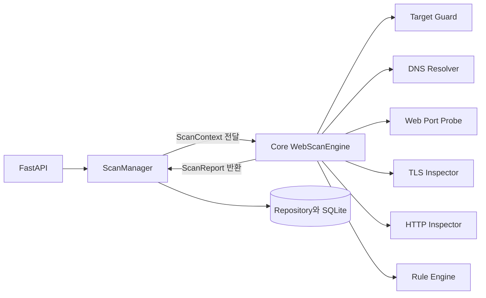
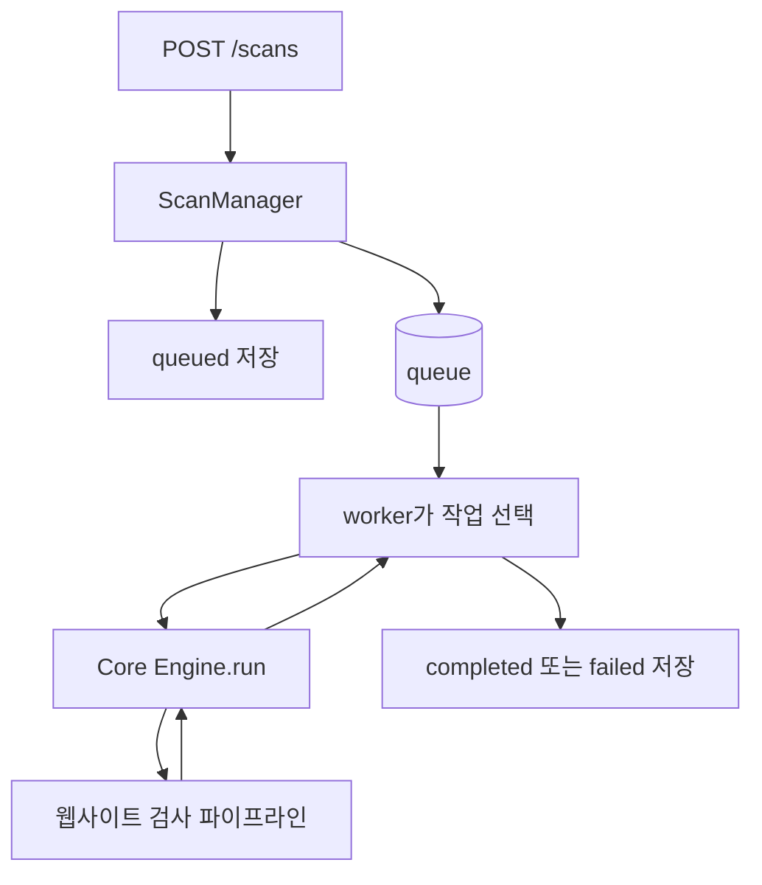
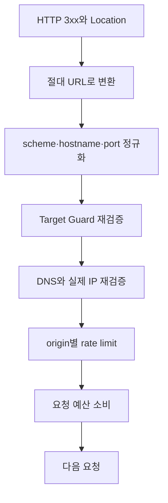

# Core 엔진 구현 설계

> 상위 문서: [[01 웹사이트 검사 Python 구현 설계]] · 처음으로: [[README]]

## 결론

`core`는 웹사이트를 직접 검사하는 기능이 아니라 **검사 순서를 지휘하는 엔진**이다.

```text
ScanManager: 언제 작업을 실행할지 관리
Core Engine: 한 작업을 어떤 순서로 검사할지 관리
Inspector: DNS·TCP·TLS·HTTP 실제 검사
Rule: 검사 결과를 판단
Repository: 결과 저장
```

처음에는 `core.py` 파일 하나로 시작할 수 있지만 기능이 늘면 모든 책임이 한 파일에 모인다. 따라서 처음부터 작은 `core` 패키지로 나누는 것을 권장한다.

```text
app/core/
├─ __init__.py
├─ engine.py       # 단계 실행 순서와 중단 조건
├─ context.py      # deadline, 취소, 요청 예산
├─ models.py       # 단계 결과와 전체 보고서
└─ errors.py       # 예상 가능한 core 오류
```

## 전체 관계



## Core가 맡는 일

1. 검사 단계를 정해진 순서로 실행한다.
2. 각 단계 전에 취소, deadline과 요청 예산을 확인한다.
3. 앞 단계 실패에 따라 뒤 단계를 실행하거나 `skipped` 처리한다.
4. 단계별 실행 시간을 기록한다.
5. Inspector가 반환한 단계 결과를 모아 전체 보고서를 만든다.
6. 모든 단계 결과와 Finding을 `ScanReport`로 묶어 반환한다.
7. redirect를 따라갈 경우 새 URL을 Target Guard로 다시 검증한다.

## Core가 맡지 않는 일

| 하지 않는 일 | 담당 구성요소 |
|---|---|
| HTTP API 경로와 인증 | FastAPI router와 dependency |
| queue에서 작업 꺼내기 | ScanManager |
| 작업 상태를 SQLite에 쓰기 | Repository |
| DNS 조회 | DNS Resolver |
| TCP 연결 | Web Port Probe |
| TLS 인증서 읽기 | TLS Inspector |
| HTTP 요청 | HTTP Inspector |
| 보안 헤더 판정 내용 | Rule Engine |
| 로그 출력 형식과 보존 | logging 설정과 journald |

Core에 이 기능들을 직접 넣지 않는 이유는 네트워크 라이브러리나 DB가 바뀌어도 검사 순서 코드를 수정하지 않기 위해서다.

## ScanManager와 Core의 차이



- ScanManager는 작업의 생성, queue, `queued/running/completed` 상태와 취소 요청을 관리한다.
- Core는 이미 선택된 작업 하나의 DNS, TCP, TLS, HTTP와 규칙 실행을 관리한다.
- Core는 FastAPI나 `asyncio.Queue`를 알 필요가 없다.
- ScanManager는 DNS와 HTTP 구현 내용을 알 필요가 없다.

## 1. context.py

Context는 한 스캔이 사용하는 실행 제한과 취소 상태를 담는다. 벽시계가 변경되어도 deadline 계산이 흔들리지 않도록 실행 시간에는 `time.monotonic()`을 사용한다.

```python
# app/core/context.py
from __future__ import annotations

import asyncio
import time
from dataclasses import dataclass, field


class ScanCancelled(Exception):
    pass


class ScanDeadlineExceeded(Exception):
    pass


class RequestBudgetExceeded(Exception):
    pass


@dataclass(slots=True)
class RequestBudget:
    maximum: int
    used: int = 0
    _lock: asyncio.Lock = field(default_factory=asyncio.Lock)

    async def consume(self, amount: int = 1) -> None:
        if amount < 1:
            raise ValueError("amount must be positive")

        async with self._lock:
            if self.used + amount > self.maximum:
                raise RequestBudgetExceeded
            self.used += amount


@dataclass(slots=True)
class ScanContext:
    scan_id: str
    target_url: str
    deadline: float
    budget: RequestBudget
    cancel_event: asyncio.Event

    def ensure_active(self) -> None:
        if self.cancel_event.is_set():
            raise ScanCancelled
        if time.monotonic() >= self.deadline:
            raise ScanDeadlineExceeded
```

`RequestBudget`에 lock을 두는 이유는 나중에 같은 origin의 검사 일부를 제한적으로 동시에 실행하더라도 요청 수가 경쟁 상태로 틀어지지 않게 하기 위해서다.

## 2. models.py

FastAPI 입출력 모델은 Pydantic을 사용하고, Core 내부의 단순 실행 상태는 `dataclass`로 가볍게 유지할 수 있다.

```python
# app/core/models.py
from __future__ import annotations

from dataclasses import dataclass, field
from enum import StrEnum
from typing import Any


class StepName(StrEnum):
    DNS = "dns"
    TCP = "tcp"
    TLS = "tls"
    HTTP = "http"
    RULES = "rules"


class StepStatus(StrEnum):
    OK = "ok"
    WARNING = "warning"
    FAILED = "failed"
    SKIPPED = "skipped"


@dataclass(slots=True)
class StepResult:
    step: StepName
    status: StepStatus
    duration_ms: int
    data: dict[str, Any] = field(default_factory=dict)
    error_code: str | None = None


@dataclass(slots=True)
class ScanReport:
    scan_id: str
    requested_url: str
    canonical_url: str | None
    steps: list[StepResult] = field(default_factory=list)
    findings: list[Any] = field(default_factory=list)
    requests_used: int = 0
```

Core 결과에 임의 예외 문자열 전체를 저장하지 않는다. 외부에 보여줄 수 있는 짧은 `error_code`와 정리된 메시지를 사용하고 상세 traceback은 민감정보를 제거한 운영 로그에만 기록한다.

## 3. errors.py

오류를 두 종류로 나눈다.

```python
# app/core/errors.py
class ExpectedScanError(Exception):
    """대상 거부처럼 정상적으로 설명할 수 있는 실행 정책 오류."""

    def __init__(self, code: str, message: str):
        super().__init__(message)
        self.code = code
        self.public_message = message


class TargetRejected(ExpectedScanError):
    pass


class StepTimeout(ExpectedScanError):
    pass
```

- 예상 가능한 오류: DNS 실패, 포트 연결 실패, TLS 검증 실패, HTTP timeout, 응답 크기 초과
- 예상하지 못한 오류: 코드 버그, 잘못된 dependency, DB 연결 코드의 프로그래밍 오류

Inspector는 자신이 사용하는 라이브러리의 예상 가능한 네트워크 오류를 `StepResult`로 바꾼다. Core는 취소, deadline, 요청 예산과 Target Guard 거부 같은 실행 정책 오류를 처리한다. 예상하지 못한 코드 오류는 숨기지 않고 ScanManager까지 올려 작업을 `failed`로 만들고 운영 로그에 남긴다.

## 4. Inspector 인터페이스

Core가 구체적인 라이브러리에 묶이지 않도록 필요한 동작만 Protocol로 정의한다.

```python
# app/core/ports.py
from typing import Protocol


class TargetGuardPort(Protocol):
    async def validate_url(self, url: str): ...
    async def validate_addresses(self, target, addresses): ...


class DnsResolverPort(Protocol):
    async def resolve(self, target): ...


class WebPortProbePort(Protocol):
    async def check(self, target, addresses): ...


class TlsInspectorPort(Protocol):
    async def inspect(self, target, addresses): ...


class HttpInspectorPort(Protocol):
    async def fetch(self, target, addresses): ...


class RuleEnginePort(Protocol):
    def evaluate(self, target, tls_result, http_result): ...
```

`Protocol`을 쓰는 이유는 시험할 때 실제 인터넷 대신 가짜 DNS Resolver와 HTTP Inspector를 쉽게 넣기 위해서다.

## 5. engine.py의 기본 형태

첫 버전은 복잡한 범용 pipeline 프레임워크보다 순서가 눈에 보이는 명시적인 코드를 사용한다.

```python
# app/core/engine.py
from __future__ import annotations

import time

from app.core.context import ScanContext
from app.core.models import ScanReport, StepName, StepResult, StepStatus


class WebScanEngine:
    def __init__(
        self,
        *,
        target_guard,
        dns_resolver,
        web_port_probe,
        tls_inspector,
        http_inspector,
        rule_engine,
    ):
        self.target_guard = target_guard
        self.dns_resolver = dns_resolver
        self.web_port_probe = web_port_probe
        self.tls_inspector = tls_inspector
        self.http_inspector = http_inspector
        self.rule_engine = rule_engine

    async def run(self, context: ScanContext) -> ScanReport:
        report = ScanReport(
            scan_id=context.scan_id,
            requested_url=context.target_url,
            canonical_url=None,
        )

        context.ensure_active()
        target = await self.target_guard.validate_url(context.target_url)
        report.canonical_url = target.canonical_url

        context.ensure_active()
        await context.budget.consume()
        dns_result = await self.dns_resolver.resolve(target)
        report.steps.append(dns_result)
        if dns_result.status == StepStatus.FAILED:
            self._skip_after(report, StepName.DNS)
            return self._finish(report, context)

        addresses = dns_result.data.get("addresses", [])
        await self.target_guard.validate_addresses(target, addresses)

        context.ensure_active()
        await context.budget.consume()
        tcp_result = await self.web_port_probe.check(target, addresses)
        report.steps.append(tcp_result)
        if tcp_result.status == StepStatus.FAILED:
            self._skip_after(report, StepName.TCP)
            return self._finish(report, context)

        tls_result = None
        if target.scheme == "https":
            context.ensure_active()
            await context.budget.consume()
            tls_result = await self.tls_inspector.inspect(
                target,
                addresses,
            )
            report.steps.append(tls_result)
            if tls_result.status == StepStatus.FAILED:
                self._skip_after(report, StepName.TLS)
                return self._finish(report, context)
        else:
            report.steps.append(self._skipped(StepName.TLS))

        context.ensure_active()
        await context.budget.consume()
        http_result = await self.http_inspector.fetch(target, addresses)
        report.steps.append(http_result)
        if http_result.status == StepStatus.FAILED:
            report.steps.append(self._skipped(StepName.RULES))
            return self._finish(report, context)

        context.ensure_active()
        started = time.monotonic()
        report.findings = self.rule_engine.evaluate(
            target,
            tls_result,
            http_result,
        )
        report.steps.append(
            StepResult(
                step=StepName.RULES,
                status=StepStatus.OK,
                duration_ms=int((time.monotonic() - started) * 1000),
                data={"finding_count": len(report.findings)},
            )
        )
        return self._finish(report, context)

    def _finish(self, report: ScanReport, context: ScanContext) -> ScanReport:
        report.requests_used = context.budget.used
        return report

    def _skipped(self, step: StepName) -> StepResult:
        return StepResult(
            step=step,
            status=StepStatus.SKIPPED,
            duration_ms=0,
        )

    def _skip_after(self, report: ScanReport, failed_step: StepName) -> None:
        order = [StepName.DNS, StepName.TCP, StepName.TLS, StepName.HTTP, StepName.RULES]
        index = order.index(failed_step)
        existing = {result.step for result in report.steps}
        for step in order[index + 1:]:
            if step not in existing:
                report.steps.append(self._skipped(step))
```

이 코드는 구조를 보여주는 뼈대다. 실제 구현에서는 Inspector가 반환하는 타입, 예상 오류 변환과 단계별 결과 저장 callback을 추가한다.

HTTP Inspector에 검증된 `addresses`를 함께 넘기는 이유는 중요하다. Inspector가 hostname을 다시 DNS 조회해 다른 IP에 연결하면 검사 전 검증을 우회하는 DNS rebinding 문제가 생길 수 있다. 실제 소켓은 검증된 IP에 연결하고, HTTPS의 인증서 검증용 SNI와 HTTP `Host`는 원래 hostname을 유지해야 한다. 사용하는 HTTP 라이브러리에서 이 동작을 보장하기 어렵다면 임의 URL을 받는 공개 API로 배포하기 전에 고정 DNS resolver 또는 전용 transport를 구현해야 한다.

## 요청 예산을 세는 기준

DNS 조회, TCP 연결, TLS 연결과 HTTP 요청은 자원 비용이 다르다. 첫 버전에는 단순하게 외부 네트워크 동작마다 budget을 소비하게 할 수 있다.

```text
DNS 조회       1
TCP 연결       1
TLS 연결       1
HTTP 요청      1
redirect 요청  각 hop마다 다시 계산
retry          재시도마다 다시 계산
```

요청 예산은 보안 규칙 함수처럼 네트워크를 사용하지 않는 계산에는 소비하지 않는다.

## 실패 후 실행 규칙

| 실패 단계 | 뒤 단계 처리 | 이유 |
|---|---|---|
| Target Guard | 전체 중단 | 승인되지 않은 대상에는 요청하면 안 됨 |
| DNS | TCP·TLS·HTTP·규칙 skipped | 연결할 주소가 없음 |
| TCP | TLS·HTTP·규칙 skipped | 웹 포트에 연결할 수 없음 |
| TLS | HTTPS의 HTTP·규칙 skipped | 인증서 검증을 끄고 계속하지 않음 |
| HTTP | 웹 규칙 skipped | 분석할 HTTP 결과가 없음 |
| 개별 규칙 | 해당 규칙 오류 기록 후 나머지 규칙 정책에 따라 계속 | 한 규칙 오류가 전체 결과를 없애지 않게 함 |

작업 상태와 단계 상태를 구분한다. DNS 실패를 정상적으로 기록했다면 작업 실행 자체는 `completed`이고 DNS StepResult는 `failed`일 수 있다. Core 내부 버그로 보고서를 만들지 못했을 때 작업을 `failed`로 표시한다.

## Redirect 처리

첫 버전은 redirect를 자동으로 따라가지 않고 `Location`만 결과에 기록하는 것이 가장 단순하고 안전하다.

나중에 따라가기 기능을 추가하면 각 hop을 새로운 검사 대상으로 취급한다.



최대 hop 수, 같은 URL 반복과 다른 origin 이동 정책을 반드시 둔다.

## 단계별 결과를 즉시 저장하려면

Core가 SQLite를 직접 호출하지 않고 작은 결과 sink 인터페이스를 받는다.

```python
from typing import Protocol


class StepResultSink(Protocol):
    async def save_step(self, scan_id: str, result: StepResult) -> None: ...
```

각 단계가 끝날 때 `sink.save_step()`을 호출하면 전원이 꺼져도 완료된 단계까지 남길 수 있다. Core는 인터페이스만 알고 실제 SQLite 코드는 Repository가 구현한다.

첫 구현에서는 최종 보고서를 한 번 저장해 단순하게 시작하고, 전원 차단 복구가 실제로 필요해질 때 단계별 저장을 추가해도 된다.

## ScanManager에서 호출

```python
from app.core.context import (
    RequestBudgetExceeded,
    ScanCancelled,
    ScanDeadlineExceeded,
)
from app.core.errors import ExpectedScanError


async def execute_scan(self, scan_id: str) -> None:
    record = await self.repository.get_scan(scan_id)
    context = self.context_factory.create(record)

    await self.repository.mark_running(scan_id)
    try:
        report = await self.engine.run(context)
        await self.repository.save_report(report)
        await self.repository.mark_completed(scan_id)
    except ScanCancelled:
        await self.repository.mark_cancelled(scan_id)
    except (ScanDeadlineExceeded, RequestBudgetExceeded) as exc:
        await self.repository.mark_failed(scan_id, type(exc).__name__)
    except ExpectedScanError as exc:
        await self.repository.mark_failed(scan_id, exc.code)
    except Exception:
        await self.repository.mark_failed(scan_id, "internal_error")
        raise
```

Core는 `queued`, `running`, `completed` DB 상태를 직접 바꾸지 않는다. 이 상태는 작업 생명주기를 소유한 ScanManager가 관리한다.

## 첫 번째 구현에서 더 단순하게 할 부분

- redirect는 따라가지 않고 기록만 한다.
- worker는 1개만 사용한다.
- WebScan Engine 내부 단계는 순차 실행한다.
- 규칙은 Python 함수 몇 개만 사용한다.
- YAML, DSL, plugin과 동적 함수 등록은 만들지 않는다.
- 단계 결과는 메모리에 모아 마지막에 한 번 저장한다.

기본 흐름이 검증된 뒤에만 redirect, 단계별 저장과 제한된 병렬 처리를 추가한다.

## Core 테스트 목록

실제 인터넷을 사용하지 않고 가짜 Inspector를 주입해 시험한다.

```text
[ ] HTTP URL 정상 완료
[ ] HTTPS URL 정상 완료
[ ] 승인되지 않은 도메인 거부
[ ] DNS 실패 시 뒤 단계 skipped
[ ] TCP timeout 시 뒤 단계 skipped
[ ] TLS 검증 실패 시 HTTP skipped
[ ] HTTP timeout과 응답 크기 초과 기록
[ ] 취소 이벤트 발생 시 중단
[ ] deadline 초과 시 중단
[ ] 요청 예산 초과 시 중단
[ ] 규칙 결과가 Finding으로 반환
[ ] 예상하지 못한 오류가 ScanManager까지 전달
[ ] redirect를 자동으로 따라가지 않음
```

## 구현 순서

1. `models.py`
2. `context.py`
3. Inspector Protocol과 가짜 구현
4. `engine.py`의 성공 경로
5. 단계 실패와 skipped 처리
6. 취소, deadline과 요청 예산
7. ScanManager 연결
8. 실제 DNS Resolver 연결
9. 실제 Web Port, TLS, HTTP Inspector 연결
10. Python 보안 규칙 연결

처음에는 가짜 Inspector로 Core만 시험한다. Core 테스트가 통과한 뒤 실제 네트워크 모듈을 하나씩 연결하면 문제 위치를 쉽게 구분할 수 있다.
