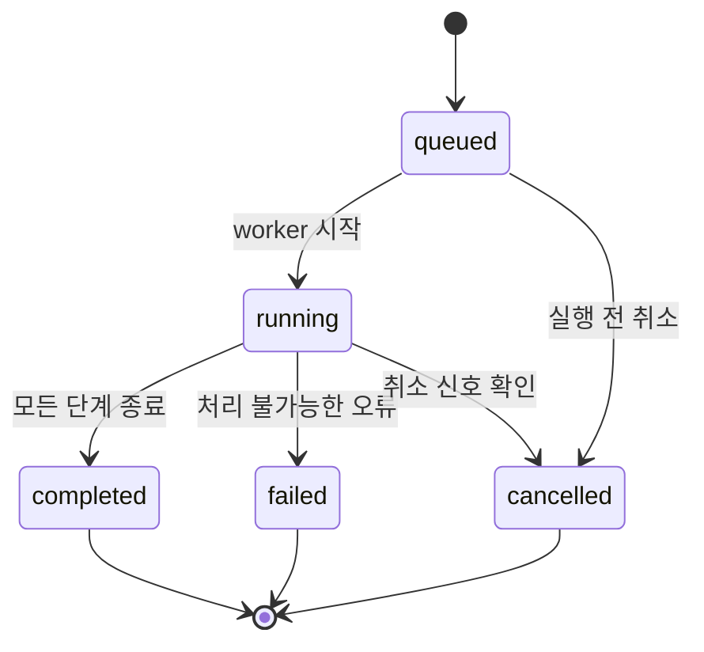

# 비동기 작업과 저장 정책

> 이전 문서: [[01 웹사이트 검사 Python 구현 설계]] · 다음 문서: [[03 보안 검토와 적용 우선순위]] · 처음으로: [[README]]

## 목표

웹사이트 DNS, TCP, TLS와 HTTP 응답을 기다리는 시간을 효율적으로 사용하면서 라즈베리파이의 CPU, 메모리와 50GB 저장 공간을 보호한다.

## 비동기가 필요한 이유

웹사이트 검사는 계산보다 외부 응답을 기다리는 시간이 많다. `asyncio`를 사용하면 한 작업이 DNS나 HTTP 응답을 기다리는 동안 다른 API 요청이나 DB 작업을 처리할 수 있다.

비동기는 무제한 병렬 실행이 아니다.

```text
asyncio
  + queue 최대 크기
  + worker 수
  + semaphore
  + rate limit
  + 요청 예산
  + timeout
```

## 작업 실행 구조


API는 웹사이트 검사가 끝날 때까지 기다리지 않고 `202 Accepted`와 `scan_id`를 반환한다. 사용자는 별도 상태 API로 결과를 확인한다.

## 초기 제한값

URL 하나를 검사하는 첫 버전의 보수적 출발값이다.

| 설정 | 초기값 | 목적 |
|---|---:|---|
| 동시 스캔 | 1개 | 여러 사이트를 동시에 검사해 메모리가 늘어나는 것 방지 |
| queue | 최대 50개 | 무제한 작업 접수 방지 |
| origin별 동시 요청 | 2개 | 같은 웹사이트 부하 제한 |
| origin별 RPS | 2 req/s | 같은 웹사이트 요청 속도 제한 |
| 작업당 총 요청 | 20회 | redirect와 retry를 포함한 작업 종료 보장 |
| connect timeout | 5초 | 연결되지 않는 사이트 대기 제한 |
| read timeout | 10초 | 응답이 멈춘 사이트 대기 제한 |
| 전체 스캔 시간 | 2분 | 하나의 작업이 worker를 계속 점유하지 않게 함 |
| 최대 응답 본문 | 1MiB | 메모리와 저장 공간 보호 |
| 최대 redirect | 3회 | redirect loop 방지 |
| 재시도 | 기본 0회 | 첫 버전의 요청량과 동작을 예측 가능하게 유지 |

성능 측정 없이 숫자를 크게 높이지 않는다.

## queue와 worker

첫 버전은 다음 구성을 사용한다.

- Uvicorn 프로세스 1개
- 애플리케이션 lifespan에서 `ScanManager` 시작
- 크기가 제한된 `asyncio.Queue`
- WebScan worker 1개
- queue에는 전체 요청 모델이 아니라 `scan_id`만 저장
- 실제 작업 정보는 SQLite에서 조회

Uvicorn worker를 여러 개 사용하면 각 프로세스에 별도 메모리 queue가 생길 수 있으므로 첫 버전에서는 사용하지 않는다.

## 상태 흐름



DNS 실패나 TLS 검증 오류가 항상 작업 전체의 `failed`를 뜻하지는 않는다. 프로그램 자체가 정상적으로 오류 결과를 기록했다면 스캔은 `completed`이고 해당 단계가 `warning` 또는 `failed`가 될 수 있다. 내부 예외로 결과조차 만들지 못했을 때 작업을 `failed`로 표시한다.

## SQLite에 저장할 데이터

### scans

- scan ID
- 입력 URL
- 정규화한 origin
- profile
- 작업 상태
- 생성·시작·완료 시간
- 제한된 오류 요약

### scan_steps

- scan ID
- `dns`, `tcp`, `tls`, `http`, `rules` 단계
- 단계 상태
- 실행 시간
- 크기가 제한된 JSON 결과

### findings

- scan ID
- rule ID
- severity와 category
- 제목
- 대상 URL
- 민감정보를 제거한 evidence
- 중복 확인 fingerprint
- 탐지 시각

## 저장하지 않을 데이터

- 전체 HTTP 응답 본문
- 요청·응답의 Authorization 헤더
- Cookie 값과 세션 ID
- 로그인 비밀번호와 API 토큰
- 대용량 HTML, 이미지, 동영상과 다운로드 파일
- DNS와 TLS 라이브러리의 전체 디버그 dump

## 선택적으로 저장할 데이터

- 상태 코드
- 응답 시간
- Content-Type과 응답 크기
- 선택한 보안 헤더
- Cookie 값이 아닌 Secure·HttpOnly·SameSite 속성
- 인증서 issuer와 유효기간
- 정규화한 DNS 주소
- Finding을 설명하는 짧은 evidence

## 응답 크기 제한

응답 전체를 메모리에 받은 후 크기를 확인하면 이미 자원을 사용한 뒤다. HTTPX의 streaming 방식으로 chunk를 읽으며 누적 크기가 `max_response_bytes`를 넘으면 즉시 중단한다.

HTML 본문을 규칙에서 사용해야 할 경우에도 검사에 필요한 앞부분만 제한적으로 유지하고 DB에는 기본 저장하지 않는다.

## 운영 로그와 검사 결과의 차이

| 구분 | 목적 | 예시 |
|---|---|---|
| 운영 로그 | 프로그램 상태와 오류 확인 | 시작, 종료, queue 포화, DB 오류 |
| 검사 결과 | 사용자가 조회할 웹사이트 정보 | DNS, TLS, HTTP, Finding |

검사 결과를 로그에서 다시 파싱하지 않고 SQLite에 구조화해 저장한다.

## 로그 정책

Raspberry Pi OS에서는 `systemd-journald`를 우선 사용한다.

### INFO

- scan ID와 상태 전환
- 검사 profile
- 단계별 시작·완료 시간
- 결과 개수

### WARNING

- 승인되지 않은 대상 거부
- timeout
- queue 포화
- 응답 크기 초과
- 디스크 여유 공간 부족

### ERROR

- 처리하지 못한 예외
- SQLite 오류
- worker 비정상 종료

### DEBUG

개발 중에만 일시적으로 사용한다. 운영에서는 전체 URL query, header와 body를 출력하지 않는다.

## 50GB 저장 공간 예산

초기 예산 예시:

| 용도 | 상한 예시 |
|---|---:|
| Raspberry Pi OS와 패키지 | 15GB |
| SQLite와 WAL | 5GB |
| journald | 500MB |
| 임시 파일 | 1GB |
| 업데이트·백업 여유 | 8GB |
| 항상 남겨둘 여유 공간 | 최소 10GB |

합계가 50GB를 채우는 방향으로 설정하지 않는다. 실제 사용량을 측정해 더 작은 상한을 유지한다.

## 디스크 보호 규칙

- 남은 공간이 10GB 이하이면 경고
- 5GB 이하이면 새 스캔 접수 중단
- 완료 결과는 기본 30일 보관 후 삭제
- 임시 파일은 작업 종료 시 즉시 삭제
- SQLite WAL checkpoint와 vacuum은 운영 부하를 고려해 별도 유지보수 시간에 수행
- 디스크 부족 상태를 `/ready`에 반영

숫자는 운영 환경을 측정한 후 조정한다.

## 재부팅 복구

메모리 queue는 재부팅하면 사라진다.

1. 작업 생성 시 SQLite에 `queued`를 먼저 저장한다.
2. queue에 `scan_id`를 넣는다.
3. 시작할 때 이전 `running` 작업을 `interrupted` 또는 `failed`로 정리한다.
4. 자동 재실행은 중복 요청 위험을 검토한 후 별도 정책으로 추가한다.

## 모니터링할 값

- queue 현재 크기와 최대 크기
- 실행 중 worker 수
- 완료·실패·취소 작업 수
- 단계별 소요 시간
- DNS·TCP·TLS·HTTP timeout 수
- origin별 rate limit 대기 횟수
- 프로세스 RSS 메모리
- SQLite와 WAL 파일 크기
- 남은 디스크 공간

URL, hostname과 IP를 metric label로 직접 넣지 않는다. 민감정보와 높은 cardinality를 방지하기 위해서다.
