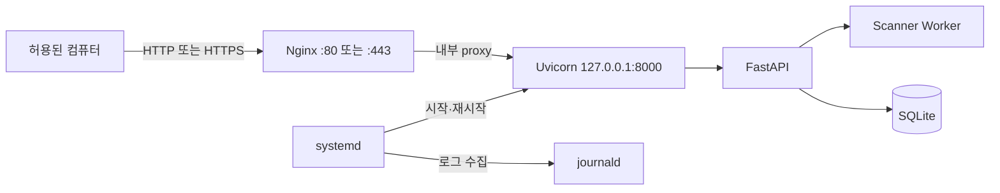
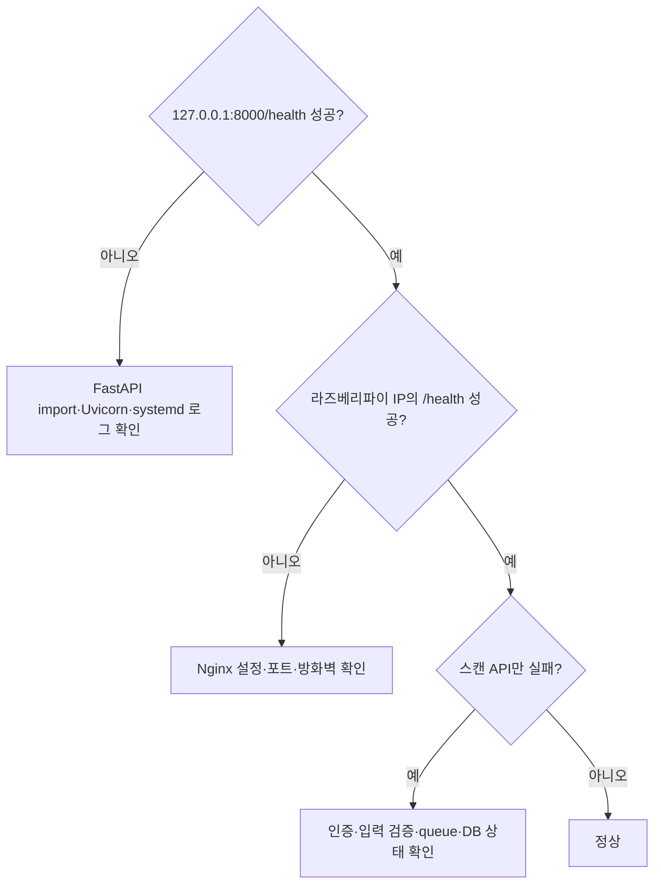

# 4. Raspberry Pi 실행 및 배포

> 이전 문서: [[03 보안 검토와 적용 우선순위]] · 처음으로: [[README]]

이 문서는 API, 작업 큐, SQLite, 자체 Scanner와 인증이 로컬 시험에서 정상 작동한 뒤 사용한다. 현재 첫 단계에서는 Uvicorn 직접 실행까지만 확인하고 Nginx와 systemd 운영 설정을 서두르지 않는다.

## 운영 구조



## 구성요소의 역할

| 구성요소 | 역할 | 이 구성을 쓰는 이유 |
|---|---|---|
| Nginx | 외부 연결, 요청 크기 제한, TLS | Uvicorn을 직접 외부에 노출하지 않고 웹 경계를 한곳에서 관리 |
| Uvicorn | FastAPI ASGI 애플리케이션 실행 | FastAPI 코드를 실제 HTTP 서버로 실행 |
| systemd | 부팅 시 자동 시작과 실패 재시작 | Raspberry Pi OS에 기본 포함되어 별도 운영 도구가 필요 없음 |
| journald | 서비스 로그 수집과 순환 | 별도 로그 파일이 무제한 증가하는 위험을 줄임 |

## 적용 전 확인 사항

다음 항목이 모두 완료되기 전에는 LAN에 스캔 API를 공개하지 않는다.

```text
[ ] /health 직접 호출 성공
[ ] API 키 인증 적용
[ ] 허용 CIDR 밖 대상 거부
[ ] queue 최대 크기 적용
[ ] worker 정상 종료 확인
[ ] SQLite 재시작 복구 확인
[ ] 요청 수·속도·시간·응답 크기 제한
[ ] 로그에서 인증정보와 Cookie 제거
```

## 1. Uvicorn 직접 실행

프로젝트 위치 예시:

```bash
cd ~/scanner-project
source .venv/bin/activate
python -m uvicorn app.main:app --host 127.0.0.1 --port 8000
```

확인:

```bash
curl http://127.0.0.1:8000/health
```

`127.0.0.1`로 여는 이유는 같은 라즈베리파이 안에서만 접근하게 하고 외부 연결은 Nginx를 통하게 하기 위해서다.

## 2. systemd 서비스

`/etc/systemd/system/pi-scanner.service` 예시:

```ini
[Unit]
Description=Raspberry Pi Scanner API
After=network-online.target
Wants=network-online.target

[Service]
Type=simple
User=<리눅스사용자명>
WorkingDirectory=/home/<리눅스사용자명>/scanner-project
ExecStart=/home/<리눅스사용자명>/scanner-project/.venv/bin/python -m uvicorn app.main:app --host 127.0.0.1 --port 8000
Restart=on-failure
RestartSec=3

[Install]
WantedBy=multi-user.target
```

`<리눅스사용자명>`은 실제 Raspberry Pi OS 사용자로 바꾼다. root로 실행하지 않는다.

```bash
sudo systemctl daemon-reload
sudo systemctl enable --now pi-scanner
sudo systemctl status pi-scanner
```

## 3. Nginx reverse proxy

`/etc/nginx/sites-available/pi-scanner` 예시:

```nginx
server {
    listen 80;
    server_name _;

    client_max_body_size 1m;

    location / {
        proxy_pass http://127.0.0.1:8000;
        proxy_http_version 1.1;
        proxy_set_header Host $host;
        proxy_set_header X-Real-IP $remote_addr;
        proxy_set_header X-Forwarded-For $proxy_add_x_forwarded_for;
        proxy_set_header X-Forwarded-Proto $scheme;
    }
}
```

활성화 전에 같은 이름의 링크나 기본 사이트와 충돌하지 않는지 확인한다.

```bash
sudo ln -s /etc/nginx/sites-available/pi-scanner /etc/nginx/sites-enabled/pi-scanner
sudo nginx -t
sudo systemctl reload nginx
```

`nginx -t`가 실패하면 reload하지 않고 오류를 먼저 고친다.

## 4. LAN에서 확인

허용된 같은 네트워크의 컴퓨터에서 호출한다.

```text
http://라즈베리파이_IP/health
```

스캔 생성 API는 반드시 API 키 인증이 적용된 상태에서만 시험한다. 공유기 포트포워딩으로 인터넷에 직접 공개하지 않는다.

## 5. 로그 확인과 저장 공간

```bash
journalctl -u pi-scanner -n 100 --no-pager
```

운영 로그에는 다음을 남기지 않는다.

- API 키
- Authorization 헤더
- Cookie와 세션 값
- 비밀번호
- 전체 HTTP 응답 본문

50GB 저장 공간에서는 journald 총량, SQLite 보존 기간, 임시 파일 삭제와 최소 여유 공간을 설정한다. 세부 정책은 [[02 비동기 작업과 저장 정책]]을 따른다.

## 6. 문제 위치 찾기



## 배포 완료 조건

```text
[ ] 재부팅 후 pi-scanner 자동 실행
[ ] Uvicorn은 127.0.0.1에서만 수신
[ ] Nginx 설정 검사 성공
[ ] 허용된 LAN 장비에서 인증된 API 호출 성공
[ ] 실패 시 systemd가 제한적으로 재시작
[ ] journald와 SQLite가 정한 용량을 넘지 않음
[ ] 인터넷에서 직접 접근할 수 없음
```
