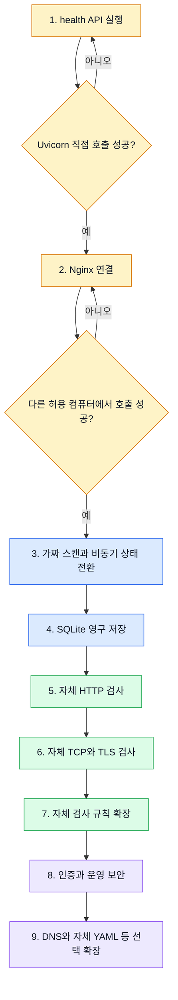

# 현재 상태에서 시작하는 방법

## 현재 준비된 상태

- Raspberry Pi OS 설치 완료
- Python 설치 완료
- FastAPI 설치 완료
- Nginx 설치 완료

이 프로그램은 Nuclei나 ZAP을 연결하는 프로그램이 아니다. 가장 먼저 **요청 하나가 자체 Python 구조를 지나 정상 응답하는 최소 경로**를 완성한다.

```text
다른 컴퓨터의 브라우저 또는 curl
  -> Nginx :80
      -> Uvicorn 127.0.0.1:8000
          -> FastAPI /health
              -> JSON 응답
```

```mermaid
flowchart LR
    C[다른 컴퓨터] -->|HTTP 요청| N[Nginx :80]
    N -->|내부 전달| U[Uvicorn 127.0.0.1:8000]
    U --> F[FastAPI]
    F --> H[/health]
    H -->|status: ok| C

    classDef outside fill:#dbeafe,stroke:#2563eb,color:#111827
    classDef inside fill:#ede9fe,stroke:#7c3aed,color:#111827
    classDef success fill:#dcfce7,stroke:#16a34a,color:#111827
    class C,N outside
    class U,F inside
    class H success
```

처음에는 이 그림의 화살표가 모두 연결되는지만 확인한다. 스캔 기능은 그다음에 추가한다.

이 경로가 확인된 후 가짜 스캔 작업, SQLite, 실제 검사 기능을 한 단계씩 추가한다.

## 지금 결정할 기본 방향

| 항목 | 초기 선택 | 이유 |
|---|---|---|
| API | FastAPI | 작업 생성, 상태, 결과 API를 만들기 쉽다. |
| 애플리케이션 서버 | Uvicorn 프로세스 1개 | 메모리 큐와 상태가 여러 프로세스로 나뉘는 문제를 피한다. |
| 앞단 웹서버 | Nginx | 외부 연결을 받고 Uvicorn은 로컬에 숨긴다. |
| 작업 처리 | `asyncio.Queue`, worker 1개 | 라즈베리파이 과부하를 막으며 구조를 먼저 검증한다. |
| 저장 | SQLite | 별도 DB 서버 없이 작업과 결과를 저장한다. |
| 검사 | HTTP 1개 기능부터 | 가장 단순한 전체 흐름을 먼저 완성한다. |
| 검사 엔진 | 자체 Python 모듈 | HTTP, TCP, TLS 등 필요한 기능을 직접 정의하고 구현한다. |
| 운영 로그 | `systemd-journald` | 로그 파일이 무제한 쌓이지 않게 한다. |

지금은 YAML 규칙 엔진, Scapy, 여러 Uvicorn worker, 대규모 동시 검사를 보류한다. Nuclei와 ZAP 연동은 개발 범위에 포함하지 않는다.

## 1단계: 설치 상태 확인

라즈베리파이 터미널에서 확인한다.

```bash
python3 --version
nginx -v
python3 -m pip --version
python3 -m uvicorn --version
```

Uvicorn 명령을 찾지 못해도 문제는 아니다. 아래 프로젝트 가상환경에 설치하면 된다.

## 2단계: 프로젝트 폴더와 가상환경

FastAPI가 전역 Python에 설치되어 있어도 프로젝트별 가상환경을 사용한다.

```bash
mkdir -p ~/scanner-project
cd ~/scanner-project
python3 -m venv .venv
source .venv/bin/activate
python -m pip install --upgrade pip
python -m pip install fastapi "uvicorn[standard]" pydantic-settings httpx aiosqlite aiolimiter PyYAML
```

`python3 -m venv`가 실패하면 Raspberry Pi OS에 `python3-venv` 패키지가 없는지 확인한다.

## 3단계: 가장 작은 FastAPI

`~/scanner-project/app/main.py`를 만든다.

```python
from fastapi import FastAPI


app = FastAPI(title="Raspberry Pi Scanner")


@app.get("/health")
async def health() -> dict[str, str]:
    return {"status": "ok"}
```

빈 `app/__init__.py`도 만든다.

```text
scanner-project/
├─ .venv/
└─ app/
   ├─ __init__.py
   └─ main.py
```

## 4단계: Uvicorn으로 직접 실행

```bash
cd ~/scanner-project
source .venv/bin/activate
python -m uvicorn app.main:app --host 127.0.0.1 --port 8000
```

같은 라즈베리파이의 다른 터미널에서 확인한다.

```bash
curl http://127.0.0.1:8000/health
```

정상 결과:

```json
{"status":"ok"}
```

### 1차 완료 조건

- Uvicorn이 오류 없이 실행된다.
- `/health`가 200 응답을 반환한다.
- Uvicorn 종료 시 오류 없이 끝난다.

## 5단계: Nginx와 연결

Uvicorn 직접 실행이 정상일 때만 Nginx를 연결한다. `/etc/nginx/sites-available/pi-scanner` 예시는 다음과 같다.

```nginx
server {
    listen 80;
    server_name _;

    client_max_body_size 1m;

    location / {
        proxy_pass http://127.0.0.1:8000;
        proxy_http_version 1.1;
        proxy_set_header Host $host;
        proxy_set_header X-Real-IP $remote_addr;
        proxy_set_header X-Forwarded-For $proxy_add_x_forwarded_for;
        proxy_set_header X-Forwarded-Proto $scheme;
    }
}
```

```bash
sudo ln -s /etc/nginx/sites-available/pi-scanner /etc/nginx/sites-enabled/pi-scanner
sudo nginx -t
sudo systemctl reload nginx
```

이미 같은 이름의 링크가 있다면 다시 만들지 않는다. 기본 사이트와 충돌하면 `/etc/nginx/sites-enabled/default` 설정을 확인한다.

다른 컴퓨터에서 호출한다.

```text
http://라즈베리파이_IP/health
```

### 2차 완료 조건

- `nginx -t`가 성공한다.
- 라즈베리파이 내부에서 Nginx를 거쳐 `/health`가 응답한다.
- 같은 허용 네트워크의 다른 컴퓨터에서도 응답한다.

인증을 만들기 전에는 인터넷 포트포워딩으로 공개하지 않는다.

## 6단계: systemd 자동 실행

수동 실행과 Nginx 연결이 정상인 뒤 등록한다. `/etc/systemd/system/pi-scanner.service` 예시는 다음과 같다.

```ini
[Unit]
Description=Raspberry Pi Scanner API
After=network-online.target
Wants=network-online.target

[Service]
Type=simple
User=<리눅스사용자명>
WorkingDirectory=/home/<리눅스사용자명>/scanner-project
ExecStart=/home/<리눅스사용자명>/scanner-project/.venv/bin/python -m uvicorn app.main:app --host 127.0.0.1 --port 8000
Restart=on-failure
RestartSec=3

[Install]
WantedBy=multi-user.target
```

`<리눅스사용자명>`은 실제 계정명으로 바꾸며 root로 실행하지 않는다.

```bash
sudo systemctl daemon-reload
sudo systemctl enable --now pi-scanner
sudo systemctl status pi-scanner
journalctl -u pi-scanner -n 100 --no-pager
```

## 7단계: 모의 스캔(Mock Scan) API

모의 스캔은 실제 IP나 웹사이트에 요청을 보내지 않고, 일정 시간 기다린 뒤 미리 정한 성공 결과를 반환하는 **개발용 시험 작업**이다. 취약점을 찾는 기능이 아니며 완성 제품의 검사 기능도 아니다.

```python
import asyncio


async def run_mock_scan(scan_id: str) -> dict[str, str]:
    await asyncio.sleep(2)
    return {
        "scan_id": scan_id,
        "status": "completed",
        "message": "모의 스캔 완료",
    }
```

실제 네트워크 검사를 붙이기 전에 다음 흐름이 올바른지 확인하는 데 사용한다.

```text
POST /scans
  -> scan_id 생성
  -> 상태 queued 저장
  -> asyncio.Queue에 입력
  -> 202 Accepted

worker
  -> 2초 동안 모의 작업
  -> running
  -> completed

GET /scans/{scan_id}
  -> 현재 상태 반환
```

확인할 것은 API 입력, 작업 ID, 큐, 상태 전환, 오류·취소 처리다. 취약점 검사는 아직 하지 않는다.

| 구분 | 모의 스캔 | 실제 스캔 |
|---|---|---|
| 네트워크 요청 | 보내지 않음 | 허가된 대상에 보냄 |
| 목적 | 프로그램 내부 흐름 시험 | 실제 장비와 서비스 검사 |
| 결과 | 미리 정한 시험 결과 | 대상 응답을 분석한 결과 |
| 위험 | 대상 장비에 영향 없음 | 요청량과 검사 방식에 따라 영향 가능 |

모의 스캔이 필요한 이유는 실제 검사부터 붙이면 문제가 API, 작업 큐, DB, 네트워크 중 어디에서 발생했는지 구분하기 어려워지기 때문이다. 내부 흐름을 먼저 검증한 뒤 `run_mock_scan()` 부분만 자체 HTTP `HttpScanner` 호출로 교체한다.

### 3차 완료 조건

- 작업 생성 응답으로 `scan_id`를 받는다.
- 상태가 `queued -> running -> completed` 순서로 변한다.
- queue 최대 크기와 worker 개수가 제한된다.

## 8단계: SQLite

모의 작업 상태를 Python 딕셔너리가 아니라 SQLite에 저장한다.

- `scans`: 작업 ID, 대상, 검사 종류, 상태, 시작·종료 시간, 오류 요약
- `findings`: 작업 ID, 검사 엔진, 규칙 ID, 심각도, 제목, 제한된 증거

프로그램 재시작 후에도 이전 작업을 조회할 수 있어야 한다. 재부팅 당시 `running`이던 작업은 우선 `failed` 또는 `interrupted`로 정리한다.

### 4차 완료 조건

- 재시작 후에도 완료 작업을 조회할 수 있다.
- 실패 원인이 제한된 문자열로 저장된다.
- 전체 HTTP 본문과 비밀번호는 저장되지 않는다.

## 9단계: 첫 실제 검사

첫 기능은 공격이 아니라 안전한 HTTP 기본 확인으로 시작한다.

- 연결 성공 여부
- HTTP 상태 코드와 응답 시간
- 제한된 응답 헤더
- TLS 인증서 만료일

필수 제한:

- timeout 10초
- redirect 자동 추적 금지와 목적지 재검증
- 응답 본문 최대 크기
- 초당 요청 수와 동시 실행 수
- 허용 CIDR 밖 대상 거부

HTTP 흐름이 안정된 뒤 `asyncio.open_connection()`으로 지정된 소수 TCP 포트의 연결 여부를 확인한다.

## 10단계: 자체 검사 엔진 확장

자체 API, 큐, DB, timeout이 안정된 뒤 직접 만든 검사 규칙을 하나씩 추가한다.

```text
ScanManager
  -> 허용 범위 재검사
  -> 자체 HTTP/TCP/TLS Scanner 선택
  -> 제한된 네트워크 요청 실행
  -> 응답을 공통 형식으로 정규화
  -> 자체 규칙으로 판정
  -> Finding을 SQLite에 저장
```

초기에는 Python 함수로 규칙을 작성한다. 규칙이 충분히 늘어나 공통 형태가 확인된 뒤에만 자체 YAML 형식을 설계한다. 다른 스캐너의 템플릿 호환을 목표로 하지 않는다.

## 11단계: 인증과 운영

다른 컴퓨터에서 실제 사용할 때 추가한다.

- API 키 또는 사용자 인증
- 허용 IP/CIDR
- 요청·큐·응답 크기 제한
- 결과 보존 기간과 디스크 여유 공간 점검
- Cookie, Authorization, 비밀번호 로그 마스킹
- HTTPS 또는 신뢰할 수 있는 내부망 정책

## 완료 조건 중심의 개발 순서



노란색 구간이 지금 해야 할 일이다. 각 확인 질문에 성공한 뒤에만 다음 단계로 이동한다.

| 순서 | 구현 목표 | 확인할 결과 |
|---|---|---|
| 1 | `/health` | Uvicorn 직접 호출 성공 |
| 2 | Nginx 연결 | 다른 허용 컴퓨터에서 호출 성공 |
| 3 | 가짜 `/scans` | 비동기 상태 전환 성공 |
| 4 | SQLite | 재시작 후 작업 조회 가능 |
| 5 | HTTP 검사 | timeout·범위 제한이 적용된 검사 성공 |
| 6 | TCP 검사 | 제한된 포트 연결 검사 성공 |
| 7 | 자체 검사 규칙 | HTTP/TCP/TLS 결과를 공통 형식으로 저장 |
| 8 | 운영 보안 | 인증, 보존 기간, 자동 실행 적용 |
| 9 | 선택 확장 | DNS, WebSocket, 자체 YAML 규칙 추가 |

## 오늘 시작할 일

1. `~/scanner-project`와 `.venv`를 만든다.
2. `/health` 하나만 있는 FastAPI 파일을 만든다.
3. Uvicorn을 `127.0.0.1:8000`에서 실행하고 `curl`로 확인한다.
4. Nginx가 `/health`를 Uvicorn으로 전달하게 만든다.

여기까지 성공하기 전에는 실제 스캔 기능으로 넘어가지 않는다.

```text
FastAPI 코드 문제인가?
  -> 127.0.0.1:8000/health 직접 확인

Nginx 연결 문제인가?
  -> nginx -t와 Nginx 로그 확인

다른 컴퓨터의 접근 문제인가?
  -> Raspberry Pi IP, 같은 네트워크, 방화벽 확인
```

## 알아야 할 것

> 현재 운영체제와 Python, FastAPI, Nginx 설치까지 끝났습니다. 먼저 Nginx, Uvicorn, FastAPI가 연결되는 최소 API를 검증합니다. 그다음 가짜 스캔으로 비동기 작업 흐름을 만들고 SQLite 저장을 추가한 뒤 자체 HTTP, TCP, TLS 검사기를 구현합니다. Nuclei는 구조를 조사할 때만 참고했으며 완성 프로그램과 연동하지 않습니다.
