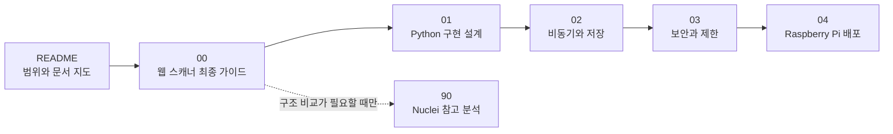
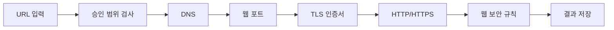
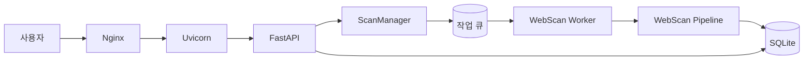
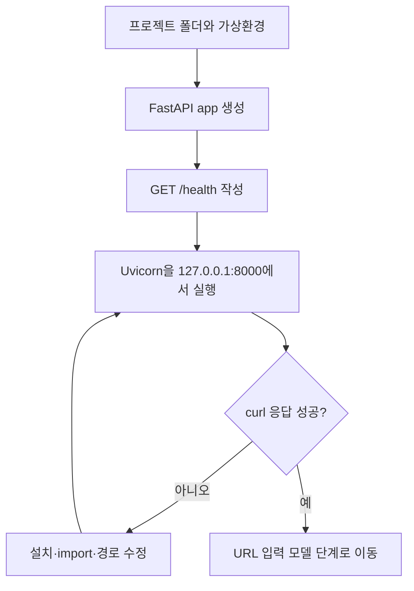

# 웹사이트 네트워크 스캐너 설계 문서

> [!important] 프로젝트 범위
> 사용자가 입력한 허가된 웹사이트 URL을 DNS → 웹 포트 → TLS → HTTP/HTTPS → 웹 보안 규칙 순서로 검사하는 독립 Python 프로그램이다. LAN 장비 발견이나 임의 전체 포트 스캔 프로그램이 아니며 Nuclei와 연동하지 않는다.

## 현재 상태

- Raspberry Pi OS 설치 완료
- Python 설치 완료
- FastAPI 설치 완료
- Nginx 설치 완료
- 현재 개발 위치: Uvicorn에서 `GET /health`가 응답하는 최소 프로그램

## 문서 읽는 순서



1. [[00 웹사이트 네트워크 스캐너 최종 가이드]]  
   무엇을 검사하고 어떤 순서로 만들지, 기술을 선택한 이유와 용어를 설명한다.

2. [[01 웹사이트 검사 Python 구현 설계]]  
   DNS, 웹 포트, TLS, HTTP와 규칙 모듈의 Python 구조와 코드 예시를 설명한다.

   - [[01-1 Core 엔진 구현 설계]]: 검사 단계의 순서, 실패·취소·요청 예산을 조정하는 중심 엔진

3. [[02 비동기 작업과 저장 정책]]  
   작업 큐, SQLite, 로그와 50GB 저장 공간 정책을 설명한다.

4. [[03 보안 검토와 적용 우선순위]]  
   승인 도메인, IP 보호, 요청 예산, origin별 rate limit과 향후 DSL 위험을 설명한다.

5. [[04 Raspberry Pi 실행 및 배포]]  
   기능과 인증이 검증된 뒤 Nginx와 systemd로 운영하는 방법을 설명한다.

6. [[90 참고 - Nuclei 구조 분석]]  
   기존 도구의 구조를 공부한 조사 자료다. 제품 구현 순서에는 포함되지 않는다.

## 웹사이트 검사 흐름



## 프로그램 구조



Nginx와 FastAPI는 사용자의 요청을 관리한다. 실제 웹사이트 검사는 WebScan Pipeline이 수행한다.

## 지금 할 일



오늘의 완료 조건:

```bash
curl http://127.0.0.1:8000/health
```

```json
{"status":"ok"}
```

## 문서 관리 원칙

- 프로젝트 범위와 개발 순서는 `00`을 최우선 기준으로 삼는다.
- Python 상세 구현은 `01`, 비동기·저장은 `02`, 보안은 `03`, 배포는 `04`에 기록한다.
- Nuclei 관련 내용은 `90`에만 참고용으로 유지한다.
- 웹사이트 검사와 관계없는 LAN 장비 발견, DHCP, MAC, 전체 포트 검사는 구현 범위에서 제외한다.
