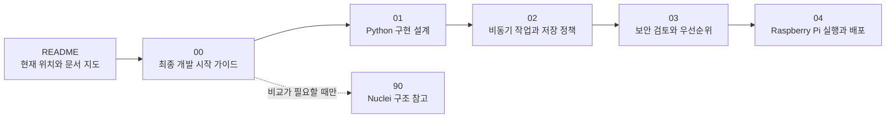
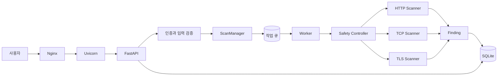
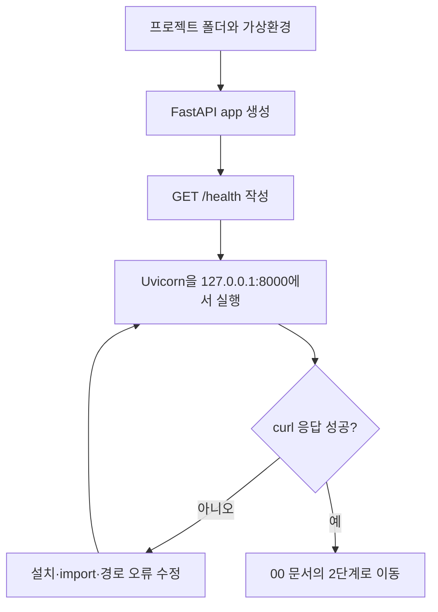

# 독립 Python 스캐너 설계 문서

> [!important] 이 폴더의 기준
> 새 프로그램은 Nuclei를 호출하거나 호환하지 않는다. Nuclei 문서는 기존 스캐너의 구조를 이해하기 위한 참고 자료일 뿐이다. 실제 제품은 Raspberry Pi OS에서 자체 Python 모듈로 구현한다.

## 현재 상태

- Raspberry Pi OS 설치 완료
- Python 설치 완료
- FastAPI 설치 완료
- Nginx 설치 완료
- 현재 개발 위치: `GET /health`가 Uvicorn에서 응답하는 최소 프로그램 만들기

## 문서 읽는 순서



1. [[00 최종 개발 시작 가이드]]  
   무엇부터 만들고 왜 그렇게 설계하는지 설명하는 최우선 기준 문서다.

2. [[01 Python 구현 설계]]  
   폴더 구조, 데이터 모델, API, Scanner 인터페이스와 코드 예시를 설명한다.

3. [[02 비동기 작업과 저장 정책]]  
   `asyncio`, 작업 큐, SQLite, 로그와 50GB 저장 공간 정책을 설명한다.

4. [[03 보안 검토와 적용 우선순위]]  
   인증, CIDR scope, 요청 예산, 대상별 rate limit과 향후 DSL 위험을 설명한다.

5. [[04 Raspberry Pi 실행 및 배포]]  
   기능 개발이 검증된 뒤 Nginx와 systemd로 운영하는 방법을 설명한다.

6. [[90 참고 - Nuclei 구조 분석]]  
   Nuclei에서 어떤 구조를 참고했는지 확인하는 조사 자료다. 구현 순서에는 포함되지 않는다.

## 프로그램 구조



## 지금 할 일



오늘의 완료 조건:

```bash
curl http://127.0.0.1:8000/health
```

```json
{"status":"ok"}
```

## 문서 관리 원칙

- 설계 결정이 바뀌면 먼저 `00 최종 개발 시작 가이드`를 수정한다.
- 상세 코드는 `01`, 비동기·저장은 `02`, 보안은 `03`, 배포는 `04`에 기록한다.
- 같은 설명을 여러 문서에 복사하지 않고 기준 문서로 링크한다.
- Nuclei 관련 조사는 `90`에만 유지하고 제품 구현과 섞지 않는다.
- 구현하지 않기로 한 기능도 삭제만 하지 않고 `00`의 제외 범위에 이유를 남긴다.

