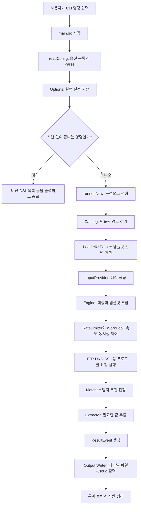

# 전체 스캔 실행 흐름 #전지성

## 앞 문서들을 합치는 위치

이 문서는 새 기능 하나를 설명하기보다 앞의 내용을 실행 순서로 합친다.

- [[02_Main과 프로그램 시작 흐름]]: `main()`과 Runner 생성
- [[03_CLI와 readConfig]]: CLI 문자열을 Options로 변환
- [[04_내부 패키지]]: Runner, Loader, Engine, Writer
- [[05_외부 패키지]]: goflags, gologger, Interactsh
- [[06_템플릿과 DSL]]: Template, Request, Matcher, Extractor

## 흐름도에서 나오는 이름 다시 확인

| 이름 | 무엇인가? | 어디서 앞서 설명했는가? |
|---|---|---|
| Options | 사용자 실행 설정 구조체 | 02, 03, 04 |
| Runner | 공통 구성요소를 생성·보관하는 구조체 | 02, 04 |
| Catalog·Loader·Parser | 템플릿 경로 탐색·선택·해석 담당 | 04, 06 |
| InputProvider | 대상을 공통 방식으로 공급하는 인터페이스 | 04 |
| ExecutorOptions | 실행 객체를 프로토콜 계층에 전달하는 구조체 | 04 |
| Engine | Template과 대상을 실행하는 구조체 | 04 |
| Matcher·Extractor | 탐지 판정과 값 추출 | 06 |
| ResultEvent | 한 건의 구조화된 탐지 결과 | 04, 06 |
| Writer | ResultEvent 출력 인터페이스 | 04 |

처음 보는 이름이 있다면 표의 앞 문서를 먼저 읽고 이 흐름으로 돌아온다.

## 한눈에 보는 세로 흐름



## 화살표가 의미하는 데이터 변화

```text
명령줄 문자열
  ↓ Parse: 문자열을 필드 값으로 해석
*types.Options
  ↓ 같은 참조 전달
*Runner.options
  ↓ 필요한 필드를 복사하고 객체 참조를 묶음
loader.Config + ExecutorOptions
  ↓ 파일 원문을 구조체로 변환
[]*templates.Template
  ↓ 대상과 실행
ResultEvent
  ↓ 직렬화 또는 화면 형식 변환
텍스트·JSON·Cloud 결과
```

같은 화살표라도 `Options → Runner`는 같은 객체 참조 전달이고, `YAML → Template`은 형식 변환이며, `ResultEvent → JSON`은 출력용 직렬화다.

## 1단계: CLI 입력

```bash
./nuclei -u https://example.com -tags cve -o result.txt
```

사용자가 대상, 템플릿 필터, 출력 방식을 문자열로 전달한다.

## 2단계: readConfig와 Options

`readConfig()`가 어떤 옵션을 받을 수 있는지 등록하고 `Parse()`가 실제 입력값을 `Options`에 저장한다. Config 파일과 Profile이 있다면 값을 병합하고 잘못된 조합을 검사한다.

## 3단계: 조기 종료 여부

`-version`, `-ldf` 같은 명령이면 필요한 정보만 출력하고 종료한다. 이 경우 아래 스캔 단계는 실행되지 않는다.

## 4단계: Runner 초기화

Runner가 현재 옵션에 맞춰 필요한 객체를 만든다. 여기서 모든 객체를 항상 만드는 것은 아니다. 예를 들어 Headless가 꺼져 있으면 브라우저 실행 구성은 필요 없다.

이 단계의 결과는 값 하나가 아니라 여러 객체를 필드로 가진 `Runner`다.

```text
*Runner
├─ *Options
├─ Catalog
├─ Parser
├─ InputProvider
├─ Writer
├─ RateLimiter
├─ Interactsh Client
└─ Progress
```

## 5단계: 템플릿 로딩

Catalog가 템플릿 위치를 찾고 Loader가 필터를 적용한다. Parser는 YAML·JSON을 Template 객체로 해석한다. Cache에 같은 결과가 있으면 재사용해 파일 읽기와 해석 비용을 줄일 수 있다.

전달되는 값의 형태도 바뀐다.

```text
CLI의 템플릿 경로 문자열
  ↓ Catalog
절대 파일 경로 목록
  ↓ Parser
*Template 객체
  ↓ Loader Store
필터를 통과한 []*Template
```

## 6단계: 대상 공급

InputProvider가 `-u`, `-l`, 표준 입력 등 서로 다른 입력을 Engine이 사용할 수 있는 대상 형태로 제공한다.

## 7단계: Engine 실행

Engine은 ScanStrategy에 따라 반복 순서를 정하고 WorkPool로 여러 작업을 동시에 실행한다. RateLimiter는 요청 속도가 설정값을 넘지 않게 제어한다.

Runner와 Engine 사이에는 `ExecutorOptions`가 있다.

```text
Runner의 필드들
  ↓ 하나의 실행 의존성 묶음으로 조립
ExecutorOptions
  ↓ SetExecuterOptions
Engine
  ↓ 템플릿별 복사·보완
HTTP·DNS·SSL 프로토콜 실행기
```

따라서 Engine이 Writer를 새로 찾는 것이 아니다. Runner가 만든 Writer의 참조가 ExecutorOptions를 통해 내려온다.

## 8단계: 프로토콜 실행

Template 객체의 요청 정의에 따라 HTTP, DNS, SSL, Network, Headless 등의 실제 실행기가 요청을 수행한다.

## 9단계: Matcher와 Extractor

- Matcher: 탐지 조건이 참인지 판단
- Extractor: 결과에서 필요한 값을 추출

매칭이 성립하면 Template ID, 프로토콜, 심각도, 대상, 추출값 등을 가진 ResultEvent가 만들어진다.

## 10단계: 출력

Output Writer가 ResultEvent를 선택한 형식으로 보낸다.

```text
Logger
└─ [INF], [WRN], [ERR], [DBG] 상태 메시지

Output Writer
└─ [template-id] [protocol] [severity] target 형태의 탐지 결과
```

`-o result.txt`의 파일에는 기본적으로 탐지 결과가 저장되며, 터미널에 보인 모든 `[INF]` 메시지가 그대로 들어가는 것은 아니다.

## 구성요소 연결에서 공유되는 것과 새로 만들어지는 것

| 요소 | 실행 동안 공유 여부 | 이유 |
|---|---|---|
| `Options` | 대부분 공유 | 모든 단계가 같은 실행 설정을 봐야 함 |
| `Logger` | 공유 | 로그 형식과 레벨 일관성 |
| `Writer` | 공유 | 결과 수와 출력 파일을 하나로 관리 |
| `RateLimiter` | 공유 | 모든 프로토콜 요청의 총속도 제한 |
| `Parser Cache` | 공유 | 같은 템플릿 재파싱 방지 |
| 템플릿별 ExecutorOptions | 일부 값을 복사·보완 | Template ID, Variables, Constants 등 현재 템플릿 정보가 다름 |
| ResultEvent | 매칭마다 새로 생성 | 서로 다른 탐지 결과를 독립적으로 표현 |

이 구조는 모든 것을 전역변수로 두는 방식과 다르다. 공통 객체는 Runner가 보관하고 명시적으로 전달하며, 실행 단위별 값은 필요한 시점에 새로 만든다.

다음 [[08_명령어별 동작]]에서는 이 전체 흐름 중 어떤 분기가 각 CLI 옵션에 의해 선택되는지 명령별로 확인한다.
