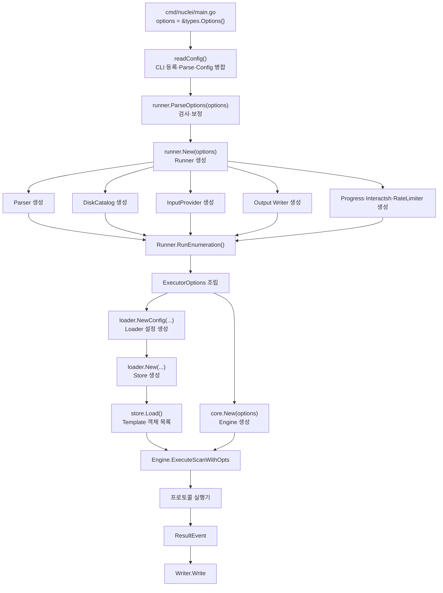

# 구성요소 연결 상세 #전지성

## 이 문서를 읽기 전에

이 문서는 앞 설명서의 종합편이다. 다음 개념을 먼저 알고 읽으면 화살표를 이해하기 쉽다.

- [[02_Main과 프로그램 시작 흐름]]의 `main()`, `types.Options`, Runner
- [[03_CLI와 readConfig]]의 FlagSet과 Parse
- [[04_내부 패키지]]의 Catalog, Loader, Parser, Engine, Writer
- [[06_템플릿과 DSL]]의 Template, Matcher, Extractor
- [[11_코드 구성요소를 읽는 방법]]의 선언·생성·사용·생명주기

## 이 문서의 화살표와 이름 규칙

| 표기 | 뜻 |
|---|---|
| `Options → Runner` | 같은 Options 객체의 참조가 Runner 필드에 저장됨 |
| `Options → loader.Config` | Loader에 필요한 필드 일부가 새 Config로 복사됨 |
| `YAML → Template` | Parser가 원문을 구조체 객체로 변환함 |
| `Runner → ExecutorOptions` | Runner가 보관한 객체 참조들을 새 전달 구조체에 묶음 |
| `Template + InputProvider → ResultEvent` | 실행과 판정을 거쳐 새로운 결과 객체가 생성됨 |

`Options`, `Config`, `ExecutorOptions`처럼 비슷한 이름이 나오면 반드시 소속 파일과 목적을 함께 본다.

```text
types.Options
└─ 사용자 실행 설정

loader.Config
└─ Template Loader에 필요한 선택 조건

protocols.ExecutorOptions
└─ 프로토콜 실행기에 전달할 공통 객체와 템플릿별 정보
```

## 전체 객체 생성 순서



## 1. Options 연결

| 단계 | 파일 | 코드 요소 | 역할 |
|---|---|---|---|
| 선언 | `pkg/types/types.go` | `type Options struct` | 설정 필드의 모양 정의 |
| 객체 생성 | `cmd/nuclei/main.go` | `options = &types.Options{}` | 이번 CLI 실행 설정 객체 생성 |
| 값 연결 | `readConfig()` | `&options.<필드>` | CLI 이름과 저장 위치 연결 |
| 값 입력 | `flagSet.Parse()` | 명령줄 파싱 | 필드 값을 변경 |
| 값 보정 | `runner.ParseOptions(options)` | 옵션 후처리 | Logger·충돌·기본값 검사 |
| 전달 | `runner.New(options)` | 포인터 전달 | Runner가 같은 Options 참조 보관 |

앞의 [[03_CLI와 readConfig]]가 `Parse()`까지 설명했다면, 이 표는 그 결과가 Runner로 넘어가는 지점부터 이어 쓴 것이다. `runner.New()`은 Options를 다시 파싱하지 않고 이미 채워진 필드를 읽는다.

## 2. Runner 연결

| 단계 | 코드 | 결과 |
|---|---|---|
| 선언 | `type Runner struct` | 공통 구성요소 필드 정의 |
| 생성 | `runner := &Runner{options: options, Logger: options.Logger}` | 최소 Runner 생성 |
| 초기화 | `runner.catalog = ...`, `runner.output = ...` | 구성요소를 필드에 연결 |
| 반환 | `return runner, nil` | main의 `nucleiRunner`가 받음 |
| 실행 | `nucleiRunner.RunEnumeration()` | 필드들을 실행 단계로 연결 |
| 정리 | `nucleiRunner.Close()` | 같은 필드의 자원 종료 |

## 3. Catalog와 Loader 연결

```text
disk.NewCatalog(templateDirectory)
  ↓ *DiskCatalog는 Catalog 인터페이스를 만족
runner.catalog 필드
  ↓
loader.NewConfig(options, r.catalog, executorOpts)
  ↓
loader.Config.Catalog
  ↓
loader.Store와 Parser가 경로 해결·파일 열기에 사용
```

Catalog가 필터를 직접 하지 않고 Loader와 나뉜 이유는 파일 접근 방식과 선택 정책이 서로 다른 책임이기 때문이다.

## 4. Parser와 Cache 연결

```text
templates.NewParser()
  ↓
Runner.parser
  ↓ ExecutorOptions.Parser
Loader/Compiler
  ↓
ParseTemplate(path, catalog)
  ├─ Parsed Cache 확인
  ├─ Catalog로 원문 열기
  ├─ YAML·JSON → Template
  └─ Parsed Cache 저장
```

Parsed Cache와 Compiled Cache를 나눈 이유는 “필터에 필요한 가벼운 상태”와 “실행기에 연결된 무거운 상태”의 생명주기가 다르기 때문이다. Parser의 `Purge()` 주석은 장시간 실행되는 내장 환경에서 무거운 객체를 계속 보관하지 않도록 Cache를 비워야 한다고 설명한다.

## 5. Loader Store와 Template 연결

```text
Options의 Templates·Tags·Severity·Author
  ↓ loader.NewConfig
loader.Config
  ↓ loader.New
loader.Store
  ↓ store.Load
[]*templates.Template
```

Store는 단순 파일 목록이 아니다. 최종 템플릿 경로, 파싱된 Template 객체, Workflow, 필터와 Metadata Index를 보관한다.

## 6. ExecutorOptions 연결

ExecutorOptions는 Runner와 프로토콜 실행기 사이의 의존성 전달 구조체다.

| Runner 필드 | ExecutorOptions 필드 | 사용 주체 |
|---|---|---|
| `r.output` | `Output` | 결과를 만드는 프로토콜 실행기 |
| `r.options` | `Options` | 전체 실행 설정이 필요한 코드 |
| `r.progress` | `Progress` | 요청·완료 통계 |
| `r.catalog` | `Catalog` | Payload·Template 관련 파일 접근 |
| `r.rateLimiter` | `RateLimiter` | 요청 직전 속도 제한 |
| `r.interactsh` | `Interactsh` | OAST URL 등록·결과 polling |
| `r.browser` | `Browser` | Headless 요청 |
| `r.parser` | `Parser` | 템플릿·Workflow 처리 |
| `r.Logger` | `Logger` | 실행 로그 |

이 구조는 Dependency Injection 방식으로 볼 수 있다. 실행기가 전역 위치에서 객체를 직접 찾지 않고, Runner가 필요한 의존성을 필드로 넣어 준다.

앞의 Runner 절에서 각각 생성된 객체가 여기서 다시 만난다. 예를 들어 `output.NewStandardWriter()`의 반환값은 먼저 `Runner.output`에 저장되고, 이후 `ExecutorOptions.Output`으로 전달된다. 따라서 두 필드는 이름이 다르지만 같은 Writer 객체를 가리킬 수 있다.

> **설계 해석:** 완전히 작은 인터페이스들로 분리된 순수한 의존성 주입 구조는 아니다. `ExecutorOptions` 자체가 매우 크고 코드 주석에도 중앙화된 구성요소의 복잡성이 언급된다. 즉 공유 객체 전달은 쉬워졌지만 구조체가 많은 책임을 가지는 절충이 존재한다.

## 7. Engine 연결

```text
core.New(r.options)
  ↓ Options로 WorkPool 구성
*Engine
  ↓ SetExecuterOptions(executorOpts)
Writer·Catalog·RateLimiter 등 연결
  ↓ ExecuteScanWithOpts
Template 목록 + InputProvider 실행
```

Engine은 ScanStrategy에 따라 Template Spray 또는 Host Spray 경로를 고르고 WorkPool에서 작업을 실행한다.

## 8. InputProvider 연결

```text
Options.Targets / TargetsFilePath / 입력 형식
  ↓ provider.NewInputProvider
구현체 선택
  ├─ SimpleInputProvider
  ├─ ListInputProvider
  └─ HttpInputProvider
  ↓ 공통 InputProvider 인터페이스
Engine.ExecuteScanWithOpts
```

Engine은 실제 구현체 이름을 검사할 필요 없이 `Count()`와 `Iterate()`를 사용한다.

## 9. Writer와 ResultEvent 연결

```text
Matcher 성공
  ↓
ResultEvent 생성
  ↓ Engine Callback 또는 프로토콜 출력 경로
output.Writer.Write(event)
  ├─ 화면
  ├─ -o 파일
  ├─ JSON 계열 Exporter
  └─ Cloud·통계 MultiWriter
```

Writer 인터페이스를 사용하므로 Engine은 결과가 파일에 쓰이는지 Cloud로 가는지 알 필요가 없다.

앞의 Template 문서에서 Matcher와 Extractor가 판정·추출한다고 설명했다. 현재 절은 그 다음 단계다. Matcher가 성공하고 Extractor 결과가 붙은 뒤 `ResultEvent`가 만들어지며, Writer는 이미 만들어진 결과를 출력할 뿐 취약 여부를 다시 판정하지 않는다.

## 10. Logger와 Writer를 분리한 이유

둘 다 터미널에 글자를 표시할 수 있지만 데이터 성격이 다르다.

| 구분 | Logger | Writer |
|---|---|---|
| 데이터 | 실행 상태·경고·오류 | 취약점 탐지 ResultEvent |
| 예 | `[INF] Templates loaded...` | `[template-id] [http] [info] target` |
| 설정 | Debug, Verbose, Silent | `-o`, JSON Export, SARIF 등 |
| 소비자 | 사람과 운영 로그 | 사람, 파일, 자동화 시스템 |

이 분리 덕분에 상태 메시지를 줄이면서 탐지 결과는 유지하거나, 탐지 결과를 JSON으로 저장하면서 상태 로그는 사람이 읽는 형태로 볼 수 있다.

## 11. 생성과 정리의 대칭

좋은 분석에서는 객체를 만드는 함수뿐 아니라 닫는 함수도 확인해야 한다.

| 생성 | 보관 | 정리 |
|---|---|---|
| `NewInputProvider` | `Runner.inputProvider` | `InputProvider.Close()` |
| `NewStandardWriter` | `Runner.output` | `Writer.Close()` |
| `interactsh.New` | `Runner.interactsh` | 상호작용 polling 종료 |
| `os.MkdirTemp` | `Runner.tmpDir` | `os.RemoveAll` |
| `templates.NewParser` | `Runner.parser` | Cache `Purge()` 경로 |

Runner가 이러한 객체를 필드에 보관하는 핵심 이유 중 하나는 정상 종료와 오류 종료 모두에서 자원을 찾아 정리하기 위해서다.

## 12. 이 구조의 장점과 부담

### 장점

- main과 실제 실행 엔진의 책임 분리
- 여러 입력·출력 구현을 인터페이스로 교체 가능
- Writer, RateLimiter, Parser Cache 같은 공통 객체 공유
- Config와 Store를 분리해 입력 조건과 로딩 결과 구분
- CLI 외의 SDK·서버 진입점에서 하위 엔진 재사용 가능

### 부담

- Options와 ExecutorOptions가 커서 처음 읽기 어려움
- 객체 생성 위치와 사용 위치가 여러 파일에 나뉨
- `SetExecuterOptions()`처럼 순서를 지켜야 하는 초기화 존재
- 인터페이스 타입만 보면 실제 구현체를 다시 검색해야 함
- Runner가 많은 구성요소의 생명주기를 관리해 크기가 커짐

따라서 이 설계를 “완벽하게 깔끔한 구조”라고 단정하면 안 된다. 대규모 기능을 하나의 CLI와 SDK에서 지원하기 위해 재사용성과 중앙 관리 편의를 얻는 대신, 연결 구조가 복잡해진 설계로 보는 것이 적절하다.
